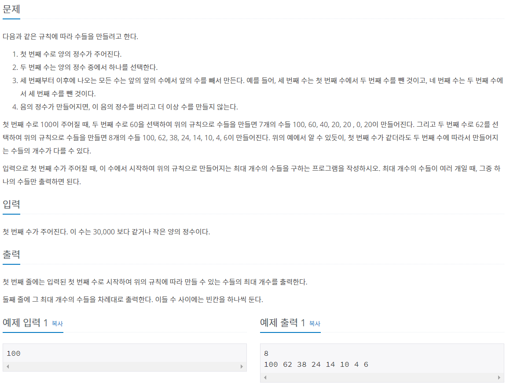

# BOJ_2635

## ✍수 이어가기 문제 설명



## 💡 문제접근

> 모든 경우의 수를 다 계산하자.
>
> 1. 주어진 수에서 1까지 값을 2번째 list값으로 넣자.
> 2. 첫번째 주어진 값과 2번쨰 값을 뺸 것을 3번째 값으로 넣어주고
> 3. 이를 계속 반복


## 🔑 코드

```python
N = int(input())
result = []
max_len = 0
for i in range(N,0,-1): # N,N-1,N-2 .... 1까지
    temp = [N]
    temp.append(i)
    # 리스트 마지막 전의 값이 0보다 같거나 클 때까지, 마지막전의 값-마지막값 해주기
    while temp[-1]>=0:
        temp.append(temp[-2]-temp[-1])
    if max_len <= len(temp):
        max_len = len(temp)
        result = temp

# 빼기를 하다보니 음수가 나오는 경우 발생 예를들어 ...8 2 6 -4 음수는 제거하주기
ans = []
for i in result:
    if i >= 0:
        ans.append(i)
print(len(ans))
for i in ans:
    print(i,end=' ')


```

[깃허브에서](https://github.com/wealways/TIL/tree/master/algorithm)


## ✅ 추가

#### -for문에서 range 거꾸로 내려가는거 

```python
for i in range(100,0,-1):
    print(i)
```

```
100,99,....1
```

#### -리스트 슬라이싱

```python
t=[1,2,3,4,5]
print(t[-1],t[-2])
print(t[:-1])
```

```
5,4
1,2,3,4
```

