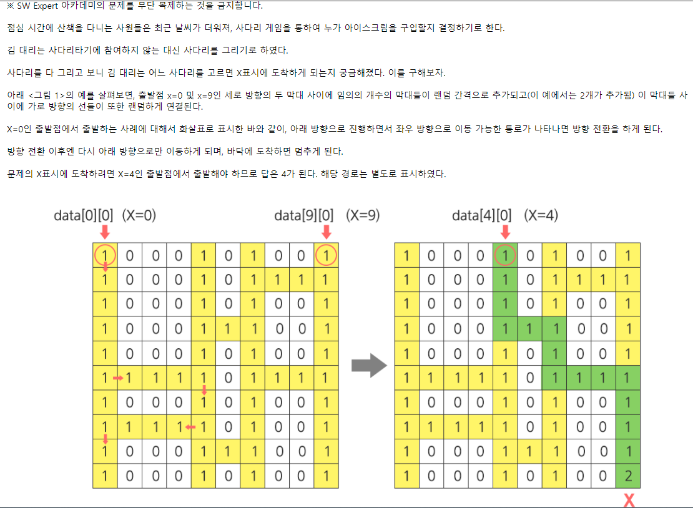
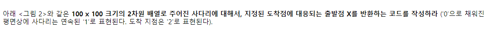
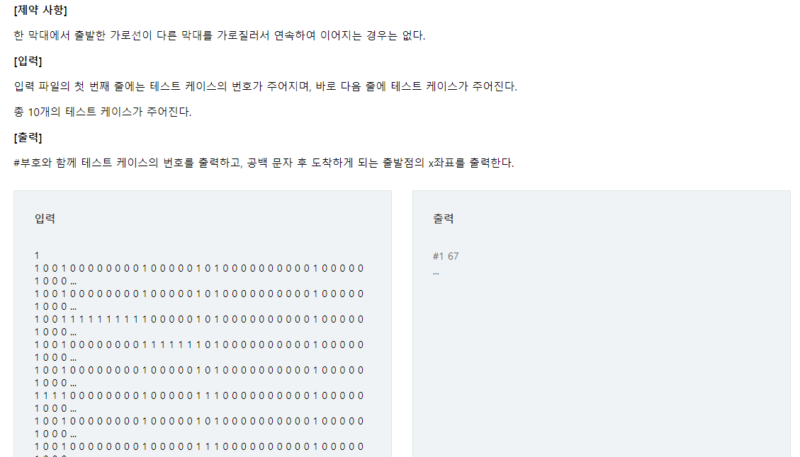

# 📝SWEA 1210 - Ladder 1







## 💡 문제접근

> DFS 같이 푸는 거 같음. 재귀사용할 수 있고, 아니면 for문 이용해서 돌릴수도 있고!
>
> ❗ 보통 사다리 타기가 위에서 아래로 내려가는건데, 이건 결과 2를 찾는거니까. 2를 먼저 찾고 위로 올라가면 시간을 단축시킬 수 있을거야.
>
> dx, dy를 이용해서 탐색하면 좋지 않을까?

## 🔑 코드

```python
def chk(y,x):
    #3
    visited.append((y,x))
    
    #4
    if y==0:
        result.append(x)
        return
    #5
    for i in range(3):
        newx=x+dx[i]
        newy=y+dy[i]
        if 0<=newx<=99 and 0<=newy<=99 and (newy,newx) not in visited:
            if input_list[newy][newx]==1:
                chk(newy,newx)

for _ in range(1,11):
    tc = int(input())
    input_list = [list(map(int,input().split())) for _ in range(100)]
    
    #1
    start_y = 99
    start_x = input_list[99].index(2)
    
    #2
    dx = [-1,1,0]
    dy = [0,0,-1]
    result = []
    visited = []
    chk(start_y, start_x)
    print(f'#{tc} {result[0]}')
    
    
    
```

#1 : 사다리 아래에 있는 2 에서부터 1을 쭉 따라 올라갈거에요.

#2 : 왼쪽, 오른쪽, 위 방향을 탐색해서 올라갈겁니다.

#3 : 탐색했으면 했다고 체크할거에요.

#4 : 최종 y인덱스가 0이면 return 갈겁니다.

#5 : 탐색한 값이 1이기 이전에, 새로운 인덱스가 조건에 맞는 지 따져야해요.

## ✅ 배운점

> 이거 이렇게 DFS 써서 탐색하지마세요... 엄청 오래걸립니다. 그냥... 2찾으면 1따라서 쭉 올라가세요....
>
> 이렇게 풀려니까, 0까지 갔다가 다른 1을 다 탐색하더라구요...
>
> 물론 처음에 y index가 0이 되면, 아예 리턴하는 방법이 있을거 같은데.. 모르겟네요...
>
> 그리고 짱구굴려서 막 짠거라, 개선사항있으면 꼭 알려주세요..
>
> " 단순하게 풀 수 있으면 그렇게 하자" 라는게 제가 이번 문제를 통해 배운겁니다🙄😣😥