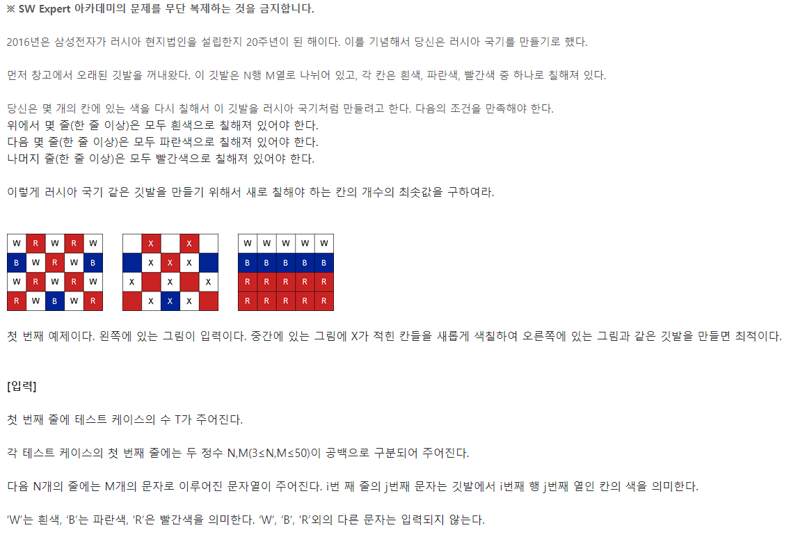
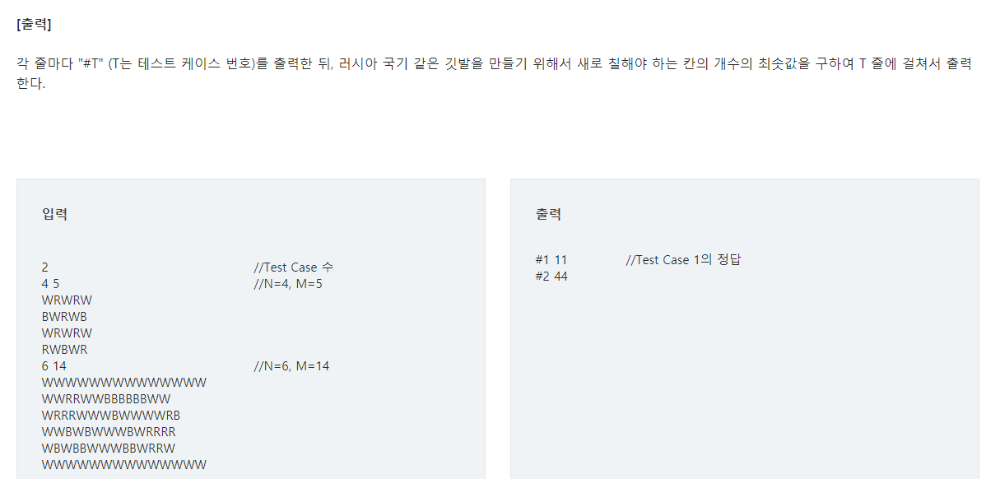

# 📝 SWEA_4613 러시아 국기 같은 깃발





## 💡 접근 방법

>흰색줄과 빨간색 줄은 최소 1줄 이상을 필수로 가져야합니다.
>
>W,B,R 줄의 개수를 정하면 모두 해결할 수 있을거에요.
>
>누적합은 과거의 정보를 일부 가지고 있어요.

## 🔑 코드

```python
T = int(input())
for tc in range(1,T+1):
    N,M = map(int,input().split())
    arr = [list(input()) for _ in range(N)]
    W = [0] * N
    B = [0] * N
    R = [0] * N
    for i in range(N):
        for j in range(M):
            if arr[i][j] != 'W':
                W[i] += 1
            if arr[i][j] != 'B':
                B[i] += 1
            if arr[i][j] != 'R':
                R[i] += 1
    for i in range(1,N):
        W[i] += W[i-1]
        B[i] += B[i-1]
        R[i] += R[i-1]
    for i in range(1,N-2):
        for j in range(i,)
```


가로세로 전치하는법

words = [list(input()) for _ in range(100)]

trans = list(zip(*words))