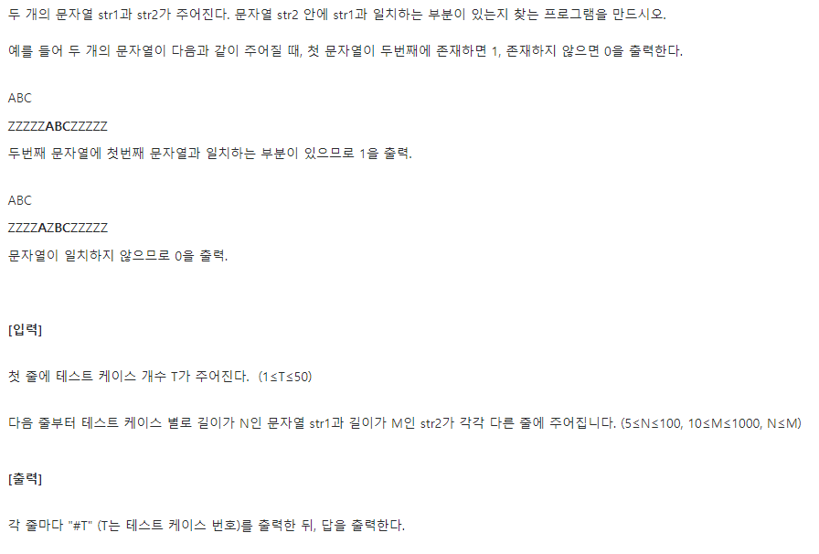
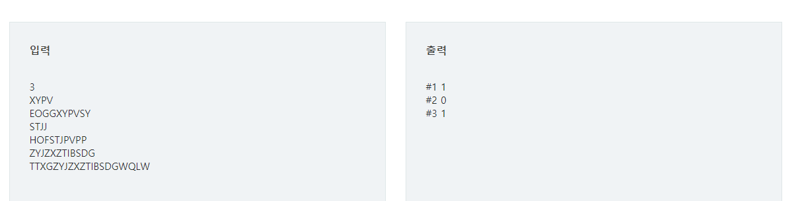
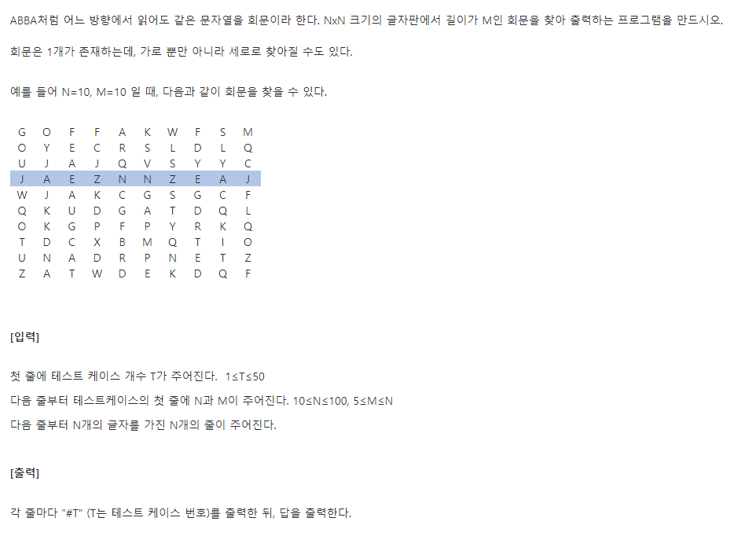
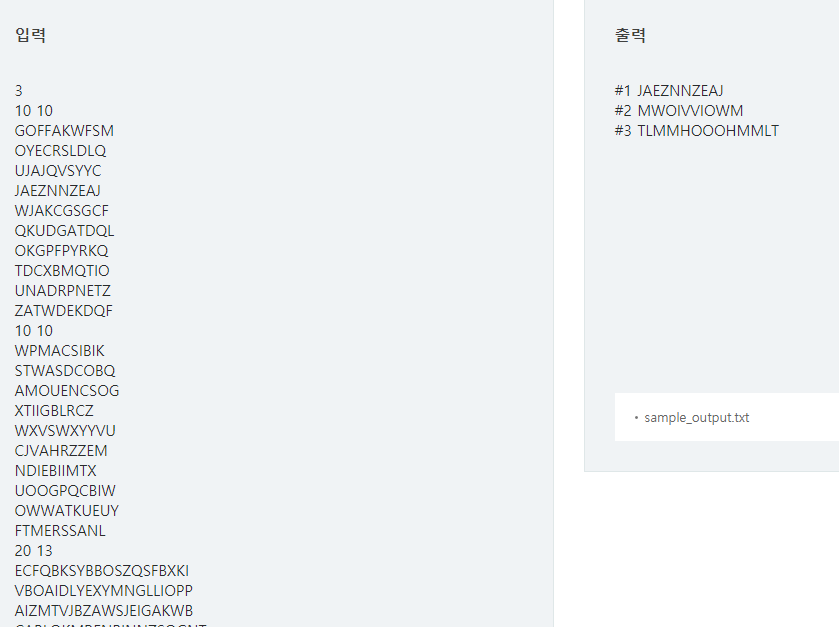
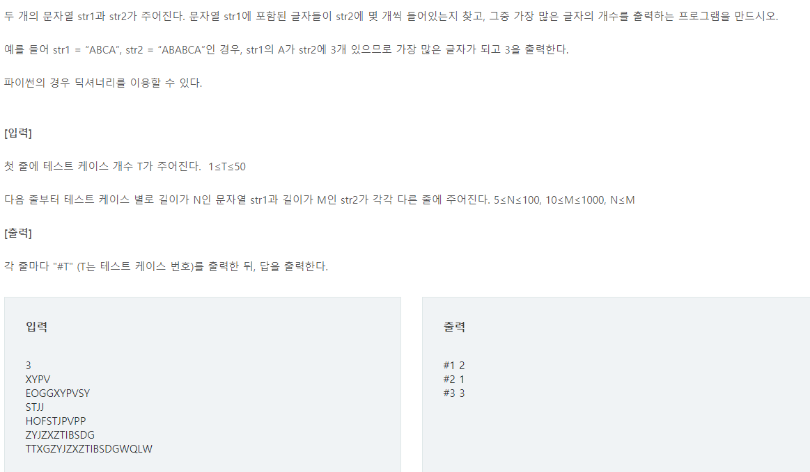

# 문자열 문제들

> SWEA 파이썬 S/W 문제해결 기본에 있는 3가지 문제들을 풀어볼거에요.
>
> 유형은 총 2가지!
>
> - 패턴찾기
> - 회문

# 📝 SWEA_4864 문자열찾기 `D2`




[문제출처 : SWEA_4864](https://swexpertacademy.com/main/learn/course/lectureProblemViewer.do)

## 💡 문제 접근

> 모든 경우 다 고려해보자. brute force 알고리즘 활용!
>
> ❗ 보이어무어 알고리즘 활용할 수 도 있는데, 아직 이해를 다 못했다...

## 🔑 코드

```python
# brute force 만들기
def brute(p,t):
    #1
    i,j = 0,0
    
    #2
    while i < len(p) and j <len(t):
        #3
        if p[i] != t[j]:
            #4
            j -= i
            i = -1
        #5
        j += 1
        i += 1
    #6
    if i == len(p):
        return 1
    else:
        return 0
    
T = int(input())
for tc in range(1,T+1):
    pattern=list(input())
    text = list(input())
    print('#{} {}'.format(tc, brute(pattern,text)))
```

 #1 : pattern를 확인할 인덱스 i / text를 확인할 인덱스 j

#2 : i가 패턴 인덱스 넘어가기 전까지 + j가 text 인덱스 넘어가기 전까지

#3 : 만약 확인할 패턴의 알파벳과 text의 알파벳이 다르다면

#4 : 한 단계 패턴 확인하던거 초기화

#5 : text의 다음알파벳 인덱스/ 패턴은 다시 첫 알파벳확인하기 위한 인덱스초기화

#6 : 무사히 패턴 다 확인했을 땐, 인덱스가 길이와 같아짐

## ✅ 배운점

> #4 ~ #5 에서 
>
> 1. 다음 글자로 이동할 때, 그동안 확인했던거 초기화 하는 방법 `j = j-i`
> 2. 코드의 연속성을 위해 `i = -1` 설정후 다음 코드에서 `i+=1` 이용한것

# 📝 SWEA_4861_회문 `D2`




[문제출처: SWEA_4861](https://swexpertacademy.com/main/learn/course/lectureProblemViewer.do)

## 💡 문제 접근

> 위의 2중 리스트에서, 가로와 세로 각각 M의 크기만큼 모든 경우의 수를 뽑아와서 회문여부를 체크해준다.
>
> 각 2중 리스트마다 답은 1개라 했기 때문에, 답이 나올경우 break!

## 🔑 코드

```python
#1
def chk(arr):
    for i in range(len(arr)//2):
        if arr[i] != arr[len(arr)-i-1]:
            return False
    return True

T = int(input())
for tc in range(1,T+1):
    N,M = map(int,input().split())
    texts = list(input())
    
    #2
    m =M
   
	#3
    for y in range(N):
        text = []
        text_t = []
        for x in range(N):
            text.append(texts[y][x])
            text_t.append(texts[x][y])
        #4
        i=0
        #5
        while m+i<=N:
            arr1 = text[0+i,m+i]
            arr2 = text_t[0+i,m+i]
            if chk(arr1):
                print('#{} {}'.format(tc,''.join(arr1)))
                break
            elif chk(arr2):
                print('#{} {}'.format(tc,''.join(arr2)))
            else:
                i += 1
```

#1 : 회문을 체크할 함수

#2 : 회문체크할 text의 길이 따로 담아두기

#3 : 가로 세로 다 체크하기 위해 2중for문

#4 : 원 text 길이와 회문 체크할 text의 길이가 다를 때, 한칸씩 index를 옮겨주기 위한 변수

#5 : #4번의 내용을 실행할 while문 / 회문체크할 text의 길이와 한칸씩 옮겨갈 변수의 합은 원 text의 길이보단 작아야함.

## ✅ 배운점

> 배운점이라기보단, 매번 먼가 변수를 할당시켜놓고 생각하는 습관을 바꿔야하지 않을까?
>
> 예를 들어 #3에서 가로 세로 일단 뽑아놓고 그 다음 회문을 chk  하는 거 말고,
>
> 가로세로를 훑고 지나가면서 회문 chk하는 방법! 같은거 말이야.

# 📝 SWEA_4865_글자 수 `D2`



[문제출처: SWEA_4865](https://swexpertacademy.com/main/learn/course/lectureProblemViewer.do)

## 💡 문제 접근

> str2를 딕셔너리로 만들어놓고 다 세자.

## 🔑 코드

```python
T = int(input())
for tc in range(1,T+1):
    str1 = list(input())
    str2 = list(input())
    d = {}
    #1
    for i in range(str2):
        if d.get(i,0)==0:
            d[i] = 1
        else:
            d[i] += 1
    #2
    maxV = 0
    for s in set(str1):
        if maxV <= d.get(s):
            maxV=d.get(s)
    print('#{} {}'.format(tc,maxV))
            
```

#1 : str2 딕셔너리로 만들어서 개수 세주자

#2 : set으로 겹치는 거 삭제해주고 최대값 구하자

## ✅ 배운점

> 배운점이라기보단
>
> #1에서 딕셔너리로 개수 만드는 방법 까먹었다. 쉽게 다시 생각할 수 있는데, 먼가 생각이 안남... 머리 오늘 치 다 썻나보다..

