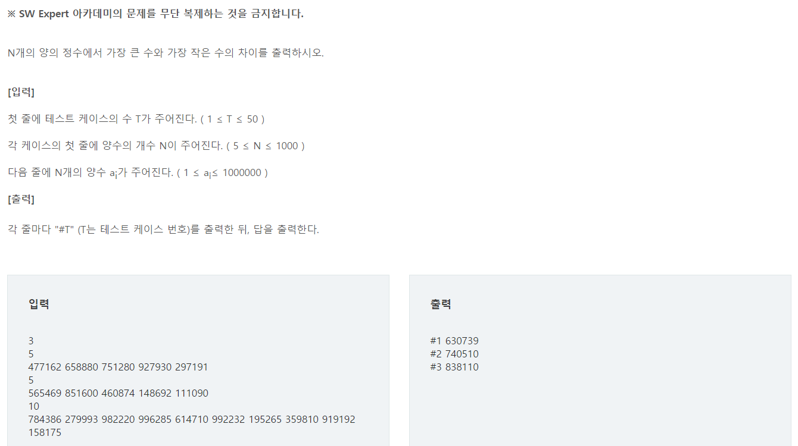
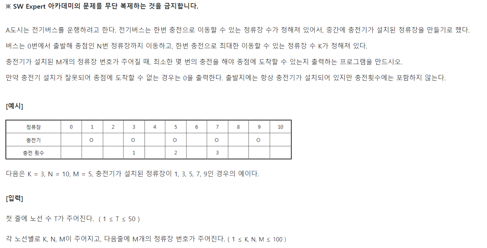
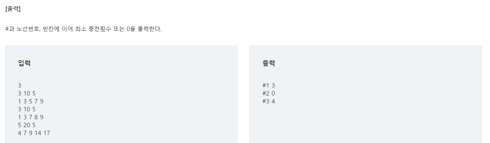
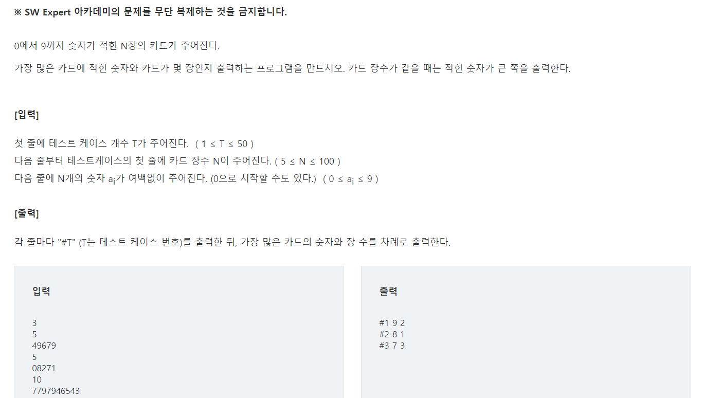
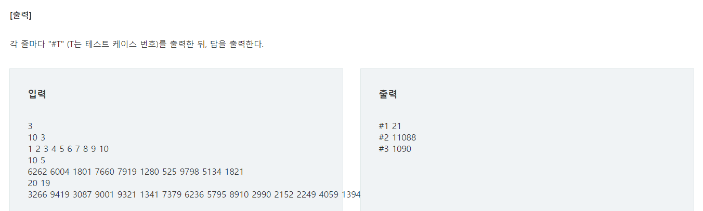

# 파이썬 SW 문제해결 기본 - List 1

## SWEA 4828 min max D2



[출처](https://swexpertacademy.com/main/learn/course/subjectDetail.do?courseId=AVuPDN86AAXw5UW6&subjectId=AWOVFCzaqeUDFAWg)

### 💡 문제접근

음.. 원래는 for문을 써서 풀어야하지만, 파이썬 내장함수 그냥 쓰자...

### 👨‍💻 코드

```python
T = int(input())
for tc in range(1,T+1):
    N = int(input())
    input_list = list(map(int,input().split()))
    print('#{} {}'.format(tc, (max(input_list)-min(input_list))))
```

✨ 배운점

음.. 없네요///

## SWEA 4831 전기버스 D3





[출처](https://swexpertacademy.com/main/learn/course/subjectDetail.do?courseId=AVuPDN86AAXw5UW6&subjectId=AWOVFCzaqeUDFAWg)

### 💡 문제접근

버스가 한번 이동할 수 있는 거리대로 line를 잘라서 그 안에 주유소가 있는 지 파악해보자

### 👨‍💻 코드

```python
T = int(input())
for tc in range(1,T+1):
    K,N,M = map(int,input().split())
    input_list = list(map(int))
    line = [0]*N
    
    #1
    for i in input_list:
        line[i]=1
    #2
    idx = 0
    result = 0
    
    #3
    while idx < N -K :
        #4
        temp = line[idx+1:idx+K+1]
        #5
        if sum(temp):
            plus_idx = 0
            #6
            for n,i in enumerate(temp):
                if i==1:
                    plus_idx = n+1
                    continue
            #7
            idx += plus_idx
            result += 1
        else:
            #8
            result = 0
            break;


    print('#{} {}'.format(tc,result))
```

#1 : 정류장 위치에 1을 집어넣는다

#2 : idx = 버스의 위치 / result는 주유한 곳 카운트

#3 : 버스위치가 최종 라인에 도달할 때까지

#4 : temp는 버스가 이동할수있는 거리 내에 주유소가 있는 지 파악할 list

#5 : 그 리스트안에 주유소가 있따면

#6 : 기름 떨어지기 전에 갈 수 있는 거리 중 가장 먼 주유소의 위치를 찾기

#7 : 현재 버스위치 + 주유소 까지 거리 = 다음 버스 위치

#8 : 만약 temp 리스트안에 주유소가 없으면 끝! -으로 반환

### ✨ 배운점

리스트내 인덱스를 가변적으로 움직이게 하기!

## SWEA 4834 숫자 카드 D2



[출처](https://swexpertacademy.com/main/learn/course/subjectDetail.do?courseId=AVuPDN86AAXw5UW6&subjectId=AWOVFCzaqeUDFAWg)

### 💡 문제접근

리스트 인덱스 활용해서 개수 구하자

### 👨‍💻 코드

```python
T = int(input())
for tc in range(1,T+1):
    N = int(input())
    input_list = [int(n) for n in input()]
    #1
    result=[0]*10
    for i in input_list:
        result[i]+=1
    #2
    maxv=0
    max_idx=0
    for idx,v in enumerate(result):
        if v>=maxv:
            maxv=v
            max_idx=idx
    print('#{} {} {}'.format(tc,max_idx,maxv))
```

#1 : 리스트 인덱스를 활용하여 개수를 계속 추가해준다.

#2 : 완성된 리스트를 불러오면서, 가장 큰 값과 그 인덱스를 찾아본다.

### ✨ 배운점

음...리스트 인덱스를 깔끔하게 활용해보자. 깔쌈하게!

## SWEA 4835 구간합 D2




[출처](https://swexpertacademy.com/main/learn/course/subjectDetail.do?courseId=AVuPDN86AAXw5UW6&subjectId=AWOVFCzaqeUDFAWg)

### 💡 문제접근

이것도 리스트 인덱스를 활용해서 구간만큼 컷!

### 👨‍💻 코드

```python
T = int(input())
for tc in range(1, T+1):
    length, cut = map(int, input().split())
    input_list = list(map(int, input().split()))
    #1
    maxv = sum(input_list[0:cut])
    minv = sum(input_list[0:cut])
	#2
    for i in range(0, length-cut+1):
        test = sum(input_list[i:i+cut])
        if minv >= test:
            minv = test
        if maxv <= test:
            maxv = test

    print('#{} {}'.format(tc, maxv-minv))
```

#1 : 초기값 세팅

#2 : 리스트 끝까지 돌면서 가장 큰 값과 가장 작은값 구하기

