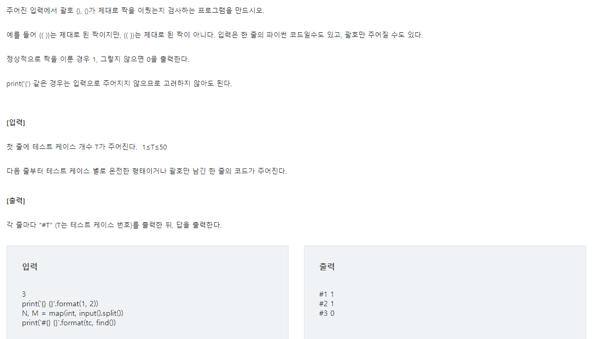
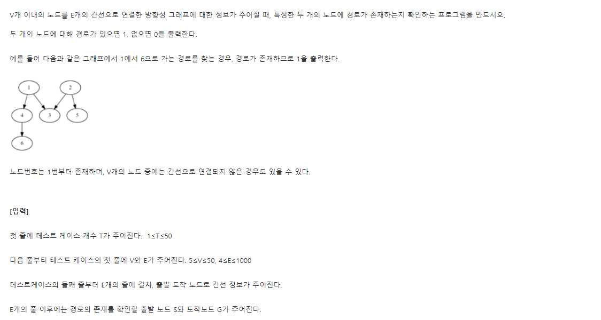
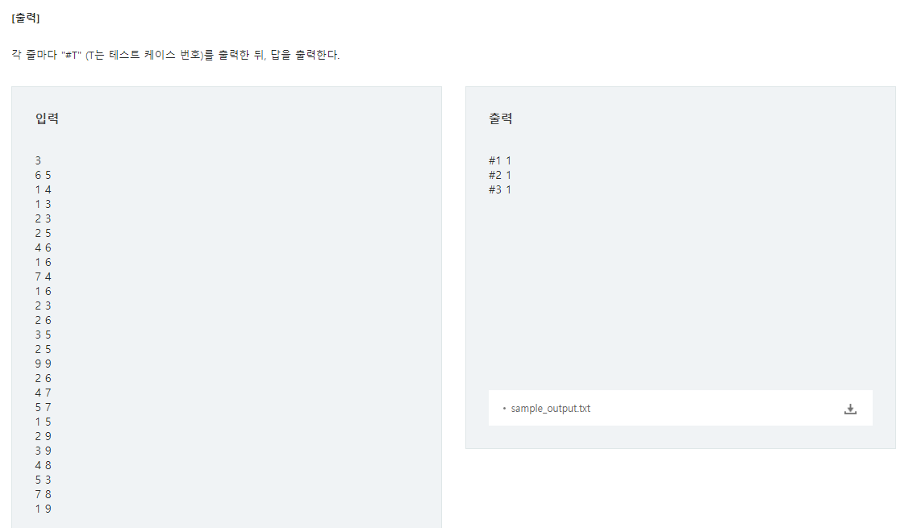
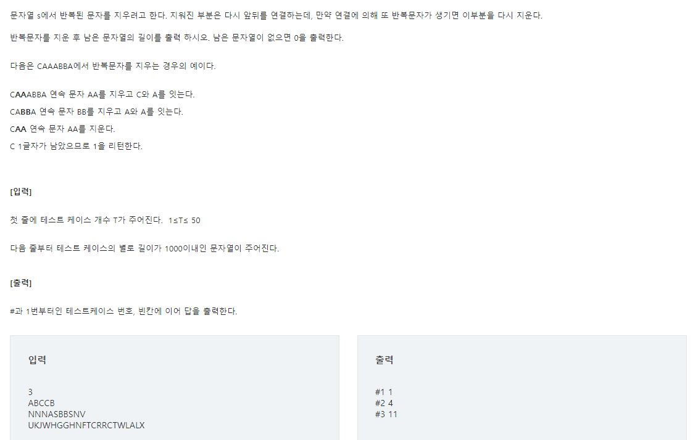

# 파이썬 SW문제해결 기본 - Stack

>유형 3가지
>
>- Memoization
>
>- DP
>- DFS

## 📝 SWEA 4869 종이붙이기 D2


[문제출처](https://swexpertacademy.com/main/learn/course/lectureProblemViewer.do)

### 💡 문제 접근

> 피보나치처럼 재귀로 쉽게 풀 수 있는 문제 종이 그림 그려보면서 규칙을 찾아봐요,

### 🔑 코드

```python
def find(N):
    n = N//10
    #1 
    if n>=3 and n>=len(memo):
        
        memo.append(find(10*(n - 1)) + 2*find(10*(n - 2)))
    return memo[n]

T = int(input())
for tc in range(1,T+1):
    N = int(input())
    #3
    memo = [0,1,3]
    print(f'#{} {}'.format(tc,find(N)))
    
```

#1 밑변의 길이가 30 이상이고, memo가 아직 다 안채워지면 계속 append하고 재귀돌리고..

#2 초기 값 설정해주는 memo

### ✅ 배운점 

> #1 조건 잘 설정해주자

## 📝 SWEA 4866 괄호검사 D2



[문제출처](https://swexpertacademy.com/main/learn/course/lectureProblemViewer.do)

### 💡 문제접근

> 간단하게 stack을 이용해서 풀어볼 수 있는 문제

### 🔑 코드

```python
T=int(input())

for tc in range(1,T+1):
    input_list = list(input())
    chk = ['(', ')', '{', '}', '[', ']']
    chk2 = {
        '(':')',
        '{':'}',
        '[':']'
    }
    stack=[]
    for i in input_list:
        #1
        if i in chk:
            #2
            if len(stack) == 0:
                stack.append(i)
            else:
                #3
                temp = stack.pop(-1)
                if chk2.get(temp) == i:
                    continue
                #4
                else:
                    stack.append(temp)
                    stack.append(i)
    print(f'#{tc} {1 if len(stack)==0 else 0}')
```

#1 : 인풋값을들 하나씩 체크할건데요. 그게 괄호인가요?

#2 : 괄호가 맞으면, 스택에 값이 없으면 일단 넣어요

#3 : 스택에 값이 있네요? 그럼 그걸 빼서 짝이 맞는지 확인해요. 짝이 맞으면 다음 인풋값을 확인합시다.

#4 :  그게 아니라면, 빼낸 값과 인풋괄호를 스택에 넣어줍시다.

### ✅ 배운점

> 딕셔너리 이용해서 짝 만들어주기
>
> 스택 적절하게 활용해보기

## SWEA 4871 그래프경로 D2





[문제출처](https://swexpertacademy.com/main/learn/course/lectureProblemViewer.do)

### 💡 문제접근

> 방향성이 존재함. DFS로 풀어보자

### 🔑 코드

```python
T = int(input())

def chk(start,end):
    #2
    if end in link.get(start,[0]):
        return 1
    #3
    if link.get(start) != None and end not in link.get(start):
        #4
        for i in link.get(start):
            if chk(i,end):
                return 1
    #5
    return 0

for tc in range(1,T+1):
    V,E = map(int,input().split())
    input_list=[list(map(int,input().split())) for _ in range(E)]
    start,end = map(int,input().split())
    link={}

    #1
    for k,val in input_list:
        if link.get(k)==None:
            link[k] = [val]
        else:
            link.get(k).append(val)

    print(f'#{tc} {chk(start,end)}')
```

#1 : 방향이 존재하니까 앞선 노드를 `딕셔너리 키`로, 앞선 노드가 이어주는 노드들을 리스트에 넣어 `딕셔너리값`으로 만들어주기

#2 : 도착노드가 시작노드의 리스트에 있으면 1을 반환 후 종료

#3 : 도착노드가 시작노드의 리스트에 없고, 아예 시작노드 리스트가 존재한다면 

#4 : 리스트안에 들어있는 노드들을 다시 #2~#3 반복하게끔 재귀함수화

#5 : 다 돌렸는데 원하는 결과를 찾지 못하면 0을 반환 후 종료

### ✅ 배운점

> 딕셔너리가 꽤나 유용하게 사용됨.
>
> 종료 조건을 잘 만들어주자

## 📝 SWEA 4873 반복문자 지우기 D2



[문제출처](https://swexpertacademy.com/main/learn/course/lectureProblemViewer.do)

### 💡 문제접근

> 스택이용해서  후딱 풀 수 있는 문제

### 🔑 코드

```python
def chk(arr):
    top = 0
    #1
    for i in arr:
        #2
        if len(s)==0:
            s.append(i)

        else:
            #3
            if s[top] != i:
                s.append(i)
                top += 1
            #4
            else:
                s.pop(top)
                if top != 0:
                    top -= 1
    return s

T= int(input())
for tc in range(1,T+1):
    input_list = list(input())
    s = list()

    print(f'#{tc} {len(chk(input_list))}')
```

#1 : 인풋 값 하나씩 확인해 봅시다.

#2 : 스택에 아무것도 없으면, 일단 넣읍시다 인풋값.

#3 : 스택에서 가장 위에 있는 값과 인풋값이 다르다면, 스택에 인풋값을 넣어줍시다( top변수는 스택 맨 위에 값을 나타내는 거에요. 그러니까 스택에 값을 넣으면 top도 +1해줘야져)

#4 : 스택 위에값과 인풋값이 같으면, pop해줍시다. 그리고 top -1 해주구요.

### ✅ 배운점

> 위에 두번째 괄호검사 문제 풀 땐, 일단 pop해서 비교했다가 아닌거 같으면 다시 넣어줬잖아요.
>
> 그런데, 이번 문제에선 top 변수를 활용해서 스택의 맨 위 인덱스를 활용했어요.
>
> 어떤게 더 편하고 괜찮은 지는 문제 더 풀어보면서 정해야겠어요.


# 소감

음.... `dfs` 어려워요😣 `dp`도 어려워요😥 문제 많이 풀어봐야겠어요... ㅅㄱ!🖐