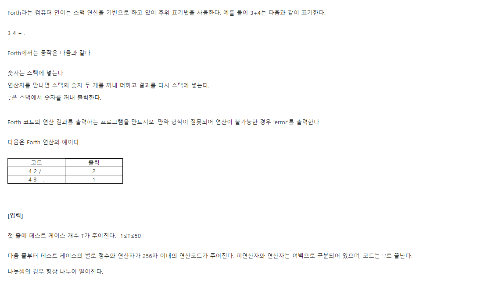
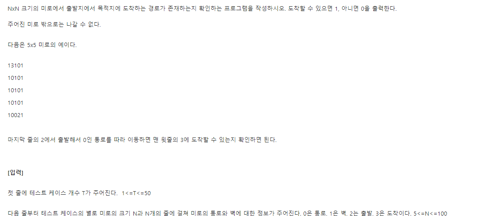
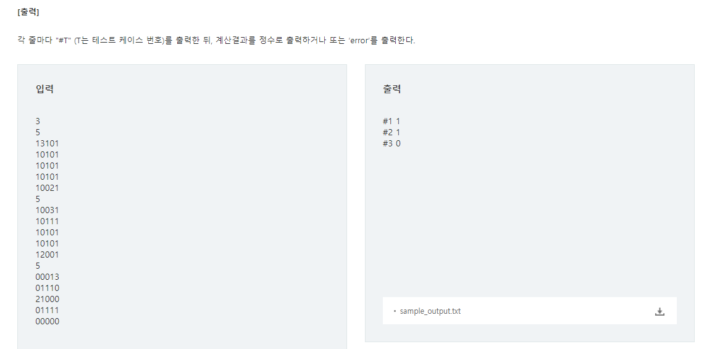
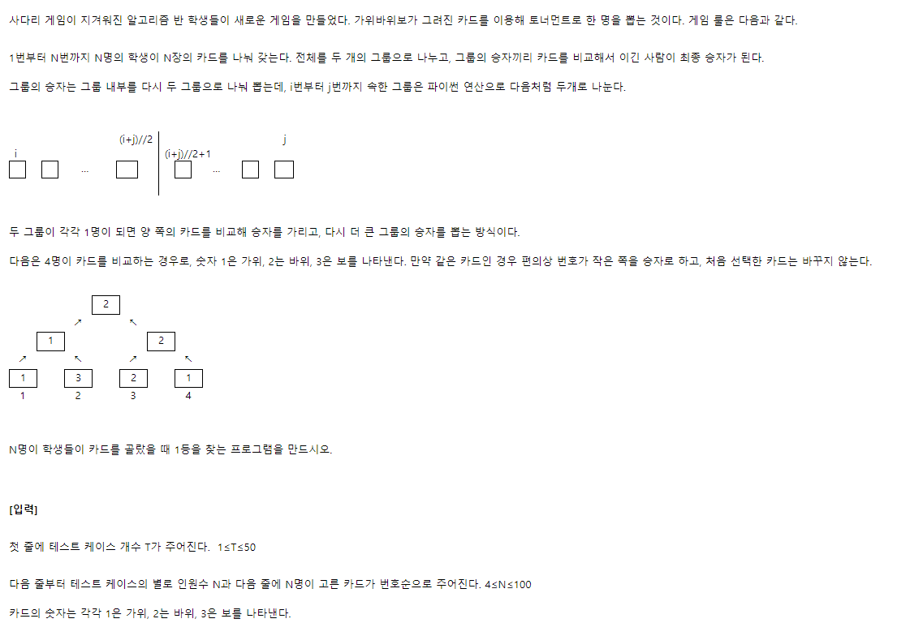
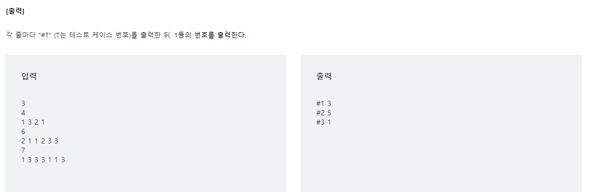
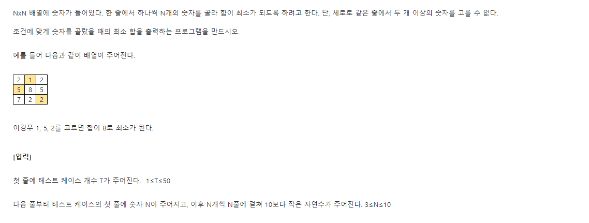
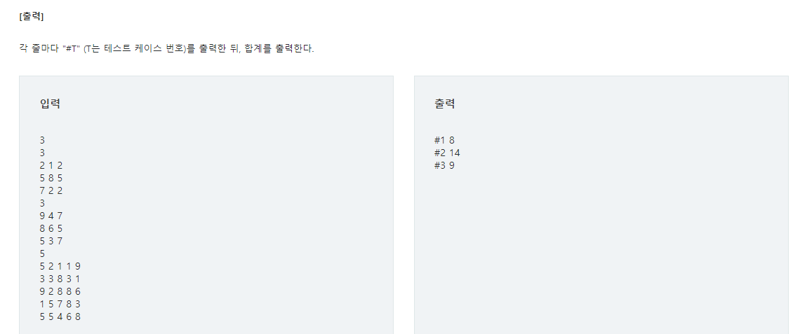

# 파이썬 SW문제해결 기본 - Stack2

- 스택
- 백트래킹
- 분할정복
- 퀵정렬

## 📝 SWEA 4874 Forth D2




### 💡 문제 접근

> 음.. 스택쌓자

### 🔑 코드

```python
T = int(input())
for tc in range(1,T+1):
    input_list = [input().split()]
    
    stack=[]
    operator = ['+','-','*','/','.']
    try:
        for i in input_list:
            #1
            if i not in operator:
                stack.append(i)
            #2
            else:
                if i=='.':
                    ans = stack.pop()
                num1,num2 = int(stack.pop()),int(stack.pop())

                if i == '*':
                    temp = num1 * num2
                    stack1.append(temp)
                elif i =='/':
                    temp = num1 // num2
                    stack1.append(temp)
                elif i =='+':
                    temp = num1 + num2
                    stack1.append(temp)
                elif i =='-':
                    temp = num1 - num2
                    stack1.append(temp)
    #3
    except:
        ans = 'error'
    if len(stack1) >= 1:
        ans = 'error'

    print(f'#{tc} {ans}')
        

```

#1 : 숫자면 stack에 넣기

#2 : operator면 그 기능에 맞게 계산하기

#3 : 에러가 나면 에러라고 알려주기

### ✅ 배운점

> 음... 스택에 쌓는건 쉽다..?

## 📝 SWEA 4875 미로 D2





### 💡 문제 접근

> dfs로 이젠 쉽게 풀 수 있을 거 같다

### 🔑 코드

```python
T = int(input())
dx=[0,0,1,-1]
dy=[1,-1,0,0]
def find(N):
    for i in range(N):
        for j in range(N):
            if input_list[i][j]=='2':
                return i,j
            
def dfs(x,y):
    #2
    global ans
    #3
    input_list[x][y]='2'
    for i in range(4):
        newx=x+dx[i]
        newy=y+dy[i]
        #4
        if 0<= newx < N and 0<=newy <N:
            #5
            if input_list[newx][newy]=='3':
                ans=1
                return True
            #6
            elif input_list[newx][newy]=='0':
                t=dfs(newx,newy)
                if t: return True
        return False
                
for tc in range(1,T+1):
    N = int(input())
    input_list = [list(input()) for _ in range(N)]
    ans=0
    #1
    startx,starty = find(N)
    dfs(startx,starty)
    print(f'#{tc} {ans}')
```

#1 : 출발 인덱스 찾기

#2 : 정답을 담을 ans 전역변수

#3 : 가는 길은 2로 바꿔서 더이상 탐색안하게 만들기

#4 : 미로 범위 내에서

#5 : 도착하면 ans=1 리턴

#6 : 길이 맞으면 계속 dfs

### ✅ 배운점

> 음.. True 나 False를 하면, 난중에 재귀가 돌아갈 때 편하다고 한던데.. 확실한건모르게따

## 📝 SWEA 4880 토너먼트 카드게임 D2





### 💡 문제 접근

> 그동안 dfs를 배우면서  위에서 아래로 내려가는 그래프를 그렸다. 그런데 이 문제는 그 그래프가 거꾸로 올라가는 느낌이다. 사실 이것도 재귀로 조건에 맞게 다 쪼갠다음에 위로 올라가면 풀 수 있을 거 같다.(~~무슨말이지이게?~~)

### 🔑 코드

```python
T = int(input())
def win(x,y):
    if (x==1 and y==3) or (x==1 and y==1):
        return 1
    elif (x == 2 and y == 1) or (x == 2 and y == 2):
        return 1
    elif (x == 3 and y == 2) or (x == 3 and y == 3):
        return 1
    return 0

def chk(arr):
    n = len(arr)
    #2
    if n<2:
        return arr[0]
    #3
    if n %2 ==0 :
        left = arr[:n//2]
        right = arr[n//2:]
    #4
    else:
        left = arr[:n // 2 +1]
        right = arr[n // 2 +1:]
    #5
    x = chk(left)
    y = chk(right)
    #6
    if win(x[0],y[0]): return x
    else: return y

for tc in range(1,T+1):
    N = int(input())
    input_list=[map(int,input().split())]
    #1
    input_list = [(n, i+1) for i, n in enumerate(input_list)]
    
```

#1 : 주어진 값하고 위치인덱스 두개 다 모두 필요하니까 이렇게 다시 저장하자

#2 : 최대한 다 쪼개기

#3 ~4 : 다 쪼개기

#5 : 쪼개기

#6 : 가위바위보 하기

### ✅ 배운점

> 음... 쪼개기하려면 dfs 생각해보자

## 📝 SWEA 4881 배열 최소 합 D2





### 💡 문제 접근

> 모든 경우의 수를 따져봐야하나? 

### 🔑 코드

```python
def chk(y):
    global temp, result
    #2
    if temp > result:
        return
    #3
    if y==N:
        if temp < result:
            result=temp
            return
    else:
        for x in range(N):
            if not visit[x]:
                #4
                visit[x]=1
                temp += input_list[y][x]
                chk(y+1)
                #5
                visit[x]=0
                temp -= input_list[y][x]

T = int(input())
for tc in range(1,T+1):
    N = int(input())
    input_list=[list(map(int,input().split())) for _ in range(N)]
    visit=[0]*N
    #1
    temp,result=0,999999
    chk(0)
    print(f'#{tc} {result}')
    
```

#1 : 모든 경우의 수를 다 따져볼 예정이라, 조건에 맞는 결과를 얻기 위해 전역변수 만들어놓기

#2 : 구하고자 하는건 최소값인데, 예를 들어 1~2열에서 이미 이전에 구한 최소값보다 크다면 3열을 확인할 필요가 없다! 따라서 이러한 경우의 수를 줄이기 위해 , 메모이제이션

#3 : 3열까지 다 구했을 때, 최소값 찾기

#4 : 하나의 열에서 방문안한 데이터를 더해주고 그 다음 열로 넘겨주기

#5 : 넘겨주고 나서는 다른 경우의 수를 따져야 하기 때문에, 방문했다는 것과 계산 추가해준 것을 원상태로 돌려놓기

### ✅ 배운점

> 메모이제이션 활용법. ㅇ순열 같은 거 만드는 방법
>
> 이 부분 조금 더 공부해보쟝~

