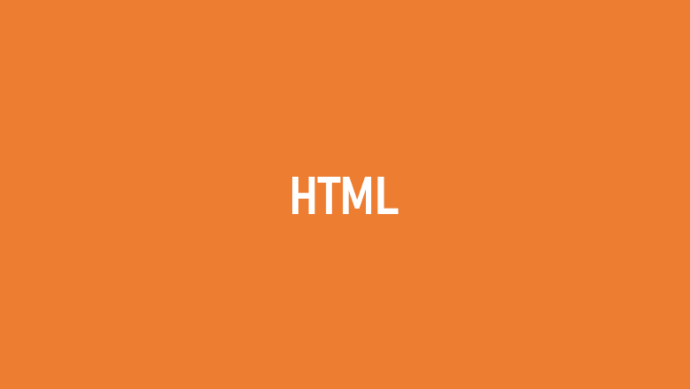

# HTML_01_making_googleform

> 새롭게 배운 attribute 나 element 들을 정리하려는 목적으로
>
> 패션 설문 조사 구글 폼을 HTML을 이용해서 만들어볼거에요. 그냥 단순하게 모양만 따라 하는 거에요😂🤣


## 정리

### autofocus

```html
<label for="name">이름을 입력해주세요.</label>
<input type="text" id="name" autofocus>
```

화면이 열렸을 때, text로 포커스가 깜박이게 만드는 것입니다.

### radio

```html
<p>1.평소에 패션에 투자 하시나요??</p>
<input type="radio" name="interest" id="no" value="no">
<label for="no">아니요</label>
<input type="radio" name="interest" id="yes" value="yes">
<label for="yes">네</label>
```

- `id`와 `for`는 연결되있어야 됨. 
- `name`을 통일하면, 둘중에 하나만 클릭할 수 있게됨.
- `value`를 설정해줘야 데이터 잘 넘어감~

### select (dropbox형태), disabled

```html
<label for="sex">성별을 선택해주세여</label>
<select name="sex" id="sex">
      <option value="">선택></option>
      <option value="f">여자</option>
      <option value="m">남자></option>
      <option value="xx" disabled>고양이</option>
</select>
```

- `select` 는 `option` 꼭 필요
- `disabled` 이것은 option엔 있지만, 선택은 못함


## 코드

```html
<!DOCTYPE html>
<html lang="en">
<head>
  <meta charset="UTF-8">
  <meta name="viewport" content="width=device-width, initial-scale=1.0">
  <title>Document</title>
</head>
<body>

  <!-- header-->
  <header>
    
    <h1>패션 설문</h1>
  </header>

  <!--section-->
  <section>
    <form action="#" method="GET">
      <div>
        <label for="name">이름을 입력해주세요.</label>
        <input type="text" id="name" autofocus>
      </div>
      <div>
        <label for="sex">성별을 선택해주세여</label>
        <select name="sex" id="sex">
          <option value="">선택</option>
          <option value="f">여자</option>
          <option value="m">남자</option>
          <option value="xx" disabled>고양이</option>
        </select>
      </div>
      <hr>
      <div>
        <p>1.평소에 패션에 투자 하시나요??</p>
        <input type="radio" name="interest" id="no" value="no">
        <label for="no">아니요</label>
        <input type="radio" name="interest" id="yes" value="yes">
        <label for="yes">네</label>
      </div>
      <div>
        <p>1-1.(예라고 대답하신 분들만)어떤 곳에 많이 투자하시나요? </p>
        <input type="radio" name="item" id="shoes" value="shoes">
        <label for="shoes">신발</label>
        <input type="radio" name="item" id="cloth" value="cloth">
        <label for="cloth">옷</label>
        <input type="radio" name="item" id="acc" value="acc">
        <label for="acc">악세사리</label>
      </div>
      <br>
      <input type="submit" value="제출하기">
      <hr>
    </form>
  </section>
  <!--footer-->
  <footer>
    <h4>수고하십쇼🤟</h4>
  </footer>
</body>
</html>
```


