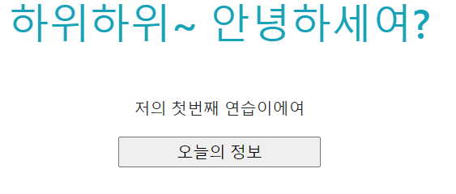
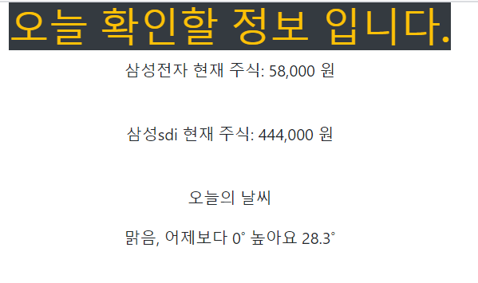

# first_project

> 다섯시간 django를 배운 후, 과제만 하고 놔두면 사라져버릴 거 같아서. 혼자 프로젝트라고 하기도 민망한 아~~~~~~~주 단순하게 django를 활용해 보았읍니다.
>
> 이름하야 `바쁘다 바빠 현대사회! - 오늘의 정보`
>
> 굉장히 단순하게,  내가 관심있는 현재 주식가격, 오늘의 날씨를 크롤링해서 보여주는 페이지를 만들었어요ㅎㅎ;;


## 구성

- 과정 : index화면에서 정보확인 버튼 클릭  -->  지정해놓은 정보 크롤링  --> html로 보여주기


📂 first_project

​	📂 articles

​		📂templates

​			📃 **index.py**

​			📃 **result.py**

​		📃 \_\_init\_\_.py

​		....

​		📃 **views.py**

​	📂first_project

​		📃 **settings.py**

​		📃**urls.py**

​	📃 manage.py	


### 화면

첫번째



두번째 



>놀라운 퀄리티!! 🙄🤣😅👽;; 
>
>css 분명 배웠는데.. 🤷‍♀️🤷‍♂️🤦‍♀️🤦‍♂️
>
>알아요... 이렇게 부끄러운 화면인데,  그럼에도 포스팅하는 이유는.
>
>난중에 더 배우고 나서 비교해보려구요. 다음번엔 발전해 있자 나야!!


### 코드

[깃 허브 코드](http://github.com/wealways/TIL/django/first_practice)


## 추가

- template는 오직 user에게 보여주는 화면으로만 구성!  모든 내부 함수이용은 view에서!!

- 크롤링하는 법 오랜만에 해서 까먹음...

  ```python
  import requests
  from bs4 import BeautifulSoup
  url1 = ''
  res = requests.get(url1)
  html = res.text
  soup = BeautifulSoup(res.content, "html.parser")
  
  # select 해오는 부분이 좀 까다로움!
  data2 = soup.select("td")[1].text
  ```

  


