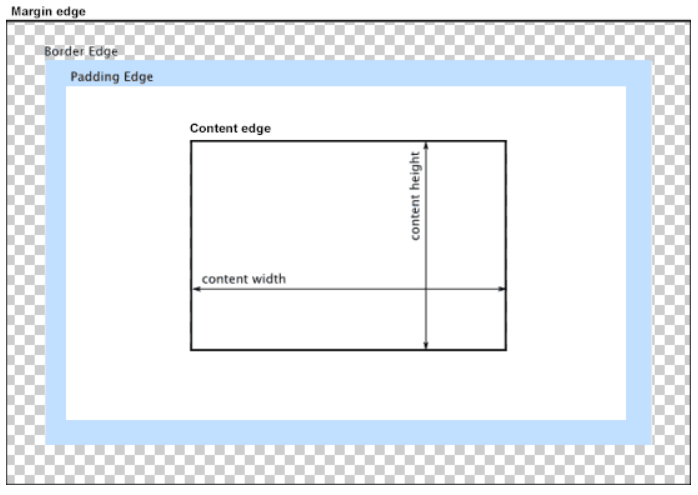
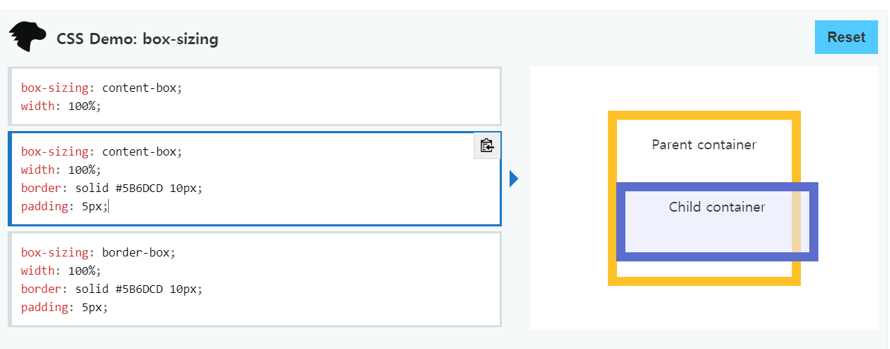
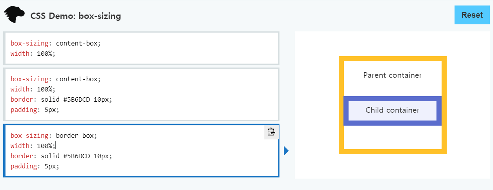

# 기본 박스 모델



## 1 Box Model

> 웹 디자인은 contents를 담을 box model을 정의하고 CSS 속성을 통해 스타일(배경, 폰트와 텍스트 등)과 위치 및 정렬을 지정하는 것.

- 모든 HTML 요소는 box 형태로 되어있다.
- 하나의 박스는 네 부분(영역)으로 이루어진다.
  - margin / border / padding / content

### 1.1 Content

- 글이나 이미지, 비디오 등 요소의 실제 내용

### 1.2 Padding(안쪽 여백)

- Border(테두리) 안쪽의 내부 여백
- 배경색, 이미지 지정 가능

### 1.3 Border

- 테두리

### 1.4 Margin (바깥쪽 여백)

- 테두리 바깥의 외부 여백
- 배경색 지정 불가

### 1.5 Box-sizing

`content-box` 



`border-box`



### 1.6 마진 상쇄

- 블록의 top 및 bottom 마진은 때로는 (결합되는 마진 중 크기가) 가장 큰 한 마진으로 결합(combine, 상쇄(collapsed)). 
-  [마진 상쇄가 발생하는 3가지 상황]([https://velog.io/@raram2/CSS-%EB%A7%88%EC%A7%84-%EC%83%81%EC%87%84Margin-collapsing-%EC%9B%90%EB%A6%AC-%EC%99%84%EB%B2%BD-%EC%9D%B4%ED%95%B4](https://velog.io/@raram2/CSS-마진-상쇄Margin-collapsing-원리-완벽-이해))


## 2 Display

### 2.1 block

- 쌓이는 박스
- 요소는 블록 요소 상자를 생성하여 일반 흐름에서 요소 앞뒤에 줄 바꿈을 생성한다.
- 블록 레벨 요소안에 인라인 레벨 요소가 들어갈 수 있다.

### 2.2 inline

- 줄바꿈이 일어나지 않는 행의 일부 요소
- content 너비만큼 가로 폭을 차지
- width, height, margin-top, margin-bottom을 지정할 수 없음
- 상하 여백은 line-height로 지정

### 2.3 inline-block

- inline 처럼 텍스트 흐름대로 나열, block처럼 박스 형태이기 block 속성 사용가능.

### 2.4 none

- 해당 요소를 화면에서 사라지게 하며 요소의 공간조차 사라지게 한다.
- `visibility: hidden;`은 해당 요소를 화면에서 사라지게는 하나 공간은 사라지지 않는다.

## 3 Position

### 3.1 박스의 위치 속성 & 값

position

- static / absolute / relative / fixed
- z-index

### 3.2 개념

- static (기본 위치)
  - 모든 태그의 기본
  - 태그의 default 값

- relative (상대 위치)
  - 기본 위치(static)를 기준으로 좌표 속성을 사용해 위치 이동

- absolute (절대 위치)
  - static 이 아닌 부모/조상 요소를 기준으로 좌표 속성 만큼 이동
  - 부모 요소를 찾아가고 나아가 없다면 body에 붙는다.

- fixed (고정 위치)
  - 부모/조상 요소와 관계없이 브라우저의 viewport를 기준으로 좌표 속성 만큼 이동
  - 스크롤을 내리거나 올려도 화면에서 사라지지 않고 항상 같은 곳에 위치

### 3.3 absolute

- `absolute`는 원래 위치해 있었던 과거 위치에 있던 공간은 더 이상 존재하지 않는다는 점이 특징이다.
- 즉, 다른 모든 것과는 별개로 독자적인 곳에 놓이게 된다.
- 언제 쓸까?
  - 페이지의 다른 요소의 위치와 간섭하지 않는 격리된 사용자 인터페이스 기능을 만들 수 있다.
  - 팝업 정보 상자 및 제어 메뉴, 롤오버 패널, 페이지 어느 곳에서나 끌어서 놓기할 수 있는 유저 인터페이스 페이지 등


## 팁

nth-child와 nth-of-type의 차이는 뭘까요?

```
nth-child는 태그상관없이 아래에 있는 모든 태그를 child로 생각하지만
nth-of-type은 앞에 언급한 태그의 type을 고려하여 child로 인식
```

