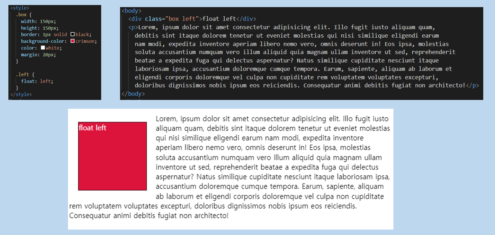
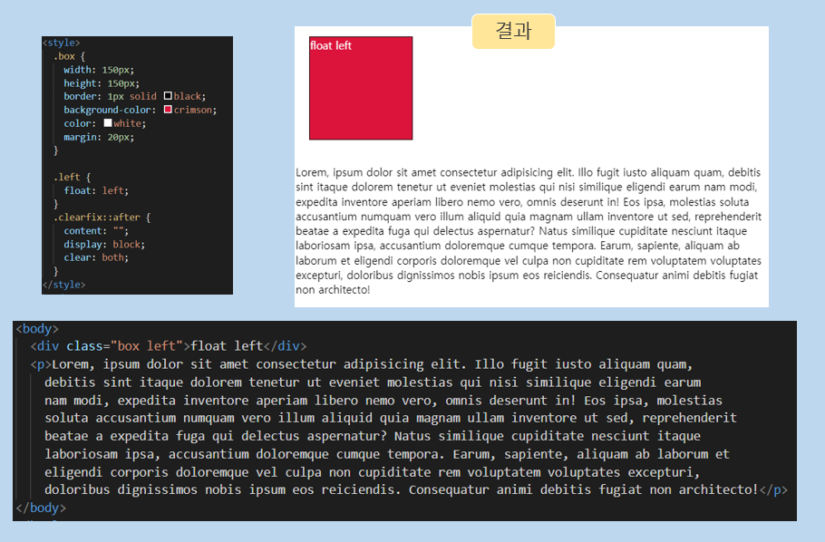
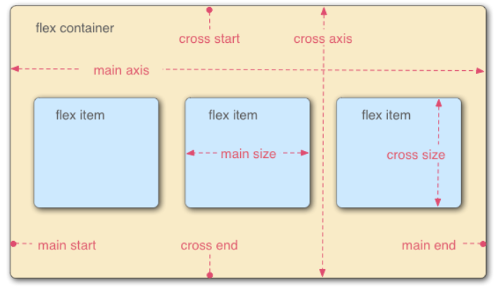

# Layout

> 웹페이지에 포함되는 요소들을 어떻게 취합하고 그것들이 어느 위치에 놓일 것인지를 제어한다.

## 1 float

> 한 요소(element)가 정상 흐름으로부터 빠져, 텍스트 및 인라인 요소가 그 주위를 감싸 자기 컨테이너의 좌, 우측에 따라 배치되어야 함을 지정한다.

### 1.1 특징

- `float:left` 왼쪽으로 붙게 되고, 따로 inline을 설정안해도 아래 그림과 같이 텍스트가 감싸게 된다.

- flexbox 및 그리드 레이아웃과 같은 기술로 인해 레거시 레이아웃 기술로 분류됨으로써, 아래 그림 용도로만 활용되고 있다.

  

### 1.2 clearfix

- float 요소와 다른 텍스트가아닌 block 요소간의 레이아웃 깨짐을 막기 위해 다음과 같이 작성한다.

## 2 flexbox

> 일명 flexbox라 불리는 Flexible Box module은 flexbox 인터페이스 내의 아이템 간 공간 배분과 강력한 정렬 기능을 제공하기 위한 1차원 레이아웃 모델로 설계되었다.
>
> 웹페이지의 컨테이너에 아이템의 폭과 높이 또는 순서를 변경해서 웹페이지의 사용 가능한 공간을 최대한 채우고 이를 디바이스 종류에 따라 유연하게 반영하도록 하는 개념

### 2.1 개념

- 요소
  - flex container
  - flex items
- 축
  - main axis (주축)
  - cross axis (교차축)

### 2.2 flex container

- flexbox 레이아웃을 형성하는 가장 기본적인 모델
- flexbox가 놓여있는 영역
- flex 컨테이널르 생성하려면 영역 내의 컨테이너 요소의 `display` 값을 `flex` 혹은 `inline-flex`로 설정
- flex 컨테이너를 선언시 아래와 같이 기본 값이 지정
  - item: row
  - item은 mainstart에서 시작
  - item은 교차축의 크기를 채우기 위해 늘어남 (stretch)
  - flex-wrap: nowrap (item이 container밖으로 넘어감)

### 2.3 flex-direction

> 쌓이는 방향 설정 (main-axis 의 방향만 바뀜. flex 는 single-direction layout concept 이기 때문)

- row (기본값)
  - 가로로 요소가 쌓임
  - row 는 주축의 방향을 왼쪽에서 오른쪽으로 흐르게 한다.
- row-reverse
- column
  - 세로로 요소가 쌓임
  - column 은 주축의 방향을 위에서 아래로 흐르게 한다.
- column-reverse

### 2.4 flex-wrap

> item들이 강제로 한 줄에 배치 되게 할 것인지 여부 설정

- nowrap (기본 값)
  - 모든 아이템들 한 줄에 나타내려고 함 (그래서 자리가 없어도 튀어나옴)
- wrap : 넘치면 그 다음 줄로
- wrap-reverse : 넘치면 그 윗줄로 (역순)

### 2.5 justify-content

> main axis 정렬
>
> `flex-direction: row` 기준으로 작성됨

- flex-start (기본 값)
  - 시작 지점에서 쌓임(왼쪽 → 오른쪽)
- flex-end
  - 쌓이는 방향이 반대 (`flex-direction: row-reverse` 와는 다르다. 아이템의 순서는 그대로 정렬만 우측에 되는 것.)
- center
- space-between
  - 좌우 정렬 (item 들 간격 동일)
- space-around
  - 균등 좌우 정렬 (내부 요소 여백은 외곽 여백의 2배)
- space-evenly
  - 균등 정렬 (내부 요소 여백과 외각 여백 모두 동일)

### 2.6 align-items

> cross axis 여러 줄 정렬
>
> `flex-direction: row` 기준으로 작성됨

- stretch (기본 값)
  - 컨테이너를 가득 채움
- flex-start
  - 위
- flex-end
  - 아래
- center
- baseline
  - item 내부의 text에 기준선을 맞춤

### 2.7 align-self

> align-items 와 동일 (단, 개별 item 에 적용)

- auto (기본 값)
- flex-start
- flex-end
- center
- baseline
- stretch
  - 부모 컨테이너에 자동으로 맞춰서 늘어난다. (Stretch 'auto'-sized items to fit the container)

### 2.8 order

- 기본 값 : 0
- 작은 숫자 일수록 앞(왼쪽)으로 이동.

### 2.9 flex-grow

- 기본 값 : 0
- 주축에서 남는 공간을 항목들에게 분배하는 방법
- 각 아이템의 상대적 비율을 정하는 것이 아님
- 음수는 불가능