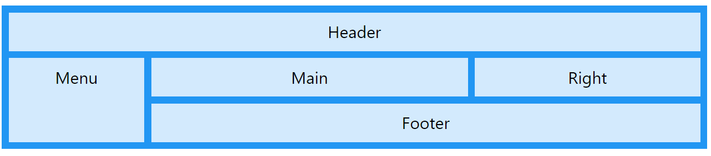
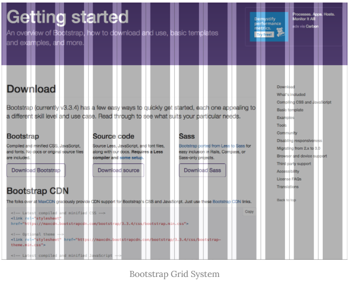
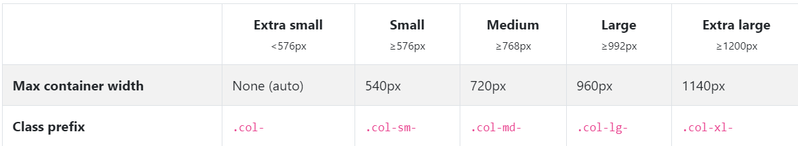

# Grid System

> bootstrap에서 정의한 layout으로서 containers, rows 그리고 columns 를 사용해서 컨텐츠를 레이아웃하고 정렬



## 1 Bootstrap

> The most popular HTML, CSS, and JS library in the world.

- 웹에서 bootsrtap가져오기

```html
<head>
    <link rel="stylesheet" href="https://stackpath.bootstrapcdn.com/bootstrap/4.5.2/css/bootstrap.min.css" integrity="sha384-JcKb8q3iqJ61gNV9KGb8thSsNjpSL0n8PARn9HuZOnIxN0hoP+VmmDGMN5t9UJ0Z" crossorigin="anonymous">
</head>
<body>
    <!--수많은 코드-->
    <script src="https://code.jquery.com/jquery-3.5.1.slim.min.js" integrity="sha384-DfXdz2htPH0lsSSs5nCTpuj/zy4C+OGpamoFVy38MVBnE+IbbVYUew+OrCXaRkfj" crossorigin="anonymous"></script>
    <script src="https://cdn.jsdelivr.net/npm/popper.js@1.16.1/dist/umd/popper.min.js" integrity="sha384-9/reFTGAW83EW2RDu2S0VKaIzap3H66lZH81PoYlFhbGU+6BZp6G7niu735Sk7lN" crossorigin="anonymous"></script>
    <script src="https://stackpath.bootstrapcdn.com/bootstrap/4.5.2/js/bootstrap.min.js" integrity="sha384-B4gt1jrGC7Jh4AgTPSdUtOBvfO8shuf57BaghqFfPlYxofvL8/KUEfYiJOMMV+rV" crossorigin="anonymous"></script>
</body>
```


### 1.1 특징

- 트위터에서 시작된 오픈 소스 프론트엔드 라이브러리
- 웹 페이지에서 많이 쓰이는 요소를 거의 전부 내장하고 있다.
- 디자인을 할 시간이 크게 줄어들고, 여러 웹 브라우저를 지원하기 위한 크로스 브라우징에 골머리를 썩일 필요가 없다.
- 웹 브라우저 크기에 따라 자동으로 정렬되는 "그리드 시스템"을 지원하며,
- *"one souce multi use"* → 반응형 웹 디자인을 추구한다.

### 1.2 Responsive web design


- layout은 방문자의 화면 해상도를 고려하여야 한다.
- 스마트폰이나 태블릿 등 모바일 기기는 화면이 작기 때문에 가독성에 더욱 신경써야 한다. 
- 보통 웹사이트가 축소되어 가로 스크롤 없이 콘텐츠를 볼 수 있으나 글자가 너무 작아지기 때문이다.
- 데스크탑용, 테블릿용, 모바일용 웹사이트를 별도 구축할 수도 있지만 One Source Multi Use의 관점에서 올바른 해결책은 아니다.
- 반응형 웹 디자인(Responsive Web Design)은 화면 해상도에 따라 가로폭이나 배치를 변경하여 가독성을 높여 이러한 문제를 해결한다.
- 즉, 하나의 웹사이트를 구축하여 다양한 디바이스의 화면 해상도에 최적화된 웹사이트를 제공하는 것이다. 


## 2 Bootstrap Grid System

### 2.1 Grid System



- 부트스트랩의 grid system 은 containers, rows 그리고 columns 를 사용해서 컨텐츠를 레이아웃하고 정렬한다.
- 모바일 우선 flexbox grid 를 사용하여 12개의 column 시스템을 가지고 있다.
- 왜 12 columns 일까 ?
  - 12는 약수가 가장 많기 때문에 한 줄에 표시할 수 있는 종류가 제일 많다.
- 다음과 같은 구조로 사용한다.
  - .container > .row > col-*

### 2.2 row

```html
<div class="container">
    <div class="row">
        <!-- 여기서 grid system 구현 -->
        <div class="col">
            <h3> grid system </h3>
            <p> 여기에서 구현됩니당</p>
        </div>
    </div>
</div>
```


- row 는 columns 의 wrapper 이다.
- 각 column 에는 공간 사이를 제어하기 위한 좌우 padding 값이 있는데 이를 `gutter` 라고도 한다.
  - row 의 margin 값과 gutter 를 제거하려면 .row 에 `.no-gutters` class 를 사용한다.


### 2.3 .col /  .col-*

- column class 는 row 당 가능한 12개 중 사용하려는 columns 수를 나타낸다.
- columns 너비는 백분율로 설정 되므로 항상 부모 요소를 기준으로 유동적으로 크기가 조정된다.
- grid layout 에서 내용은 반드시 columns 안에 있어야 하며 그리고 오직 columns 만 row 의 바로 하위 자식 일 수 있다.


### 2.4 offset

- `offset-*` 은 지정한 만큼의 column 공간을 무시하고 다음 공간부터 컨텐츠를 적용한다.


### 2.5 Nesting

- .row > .col-* > .row > .col-* 의 방식으로 중첩 사용 가능하다.


### 2.6 Grid breakpoints



- 부트스트랩 grid system 은 다양한 디바이스에서 적용하기 위해 특정 px 조건에 대한 지점을 정해 두었는데 이를 breakpoints 라고 한다.
- 부트스트랩은 대부분의 크기를 정의하기 위해 em 또는 rem 을 사용하지만 px 는 그리드  breakpoint 에 사용된다. (뷰포트 너비가 픽셀 단위이고 글꼴 크기에 따라 변하지 않기 때문)


## 참고

[w3schools](https://www.w3schools.com/css/css_rwd_intro.asp)

[poiemaweb](https://poiemaweb.com/bootstrap-grid-system)

[bootstrap DOCS](https://getbootstrap.com/docs/4.5/layout/grid/)