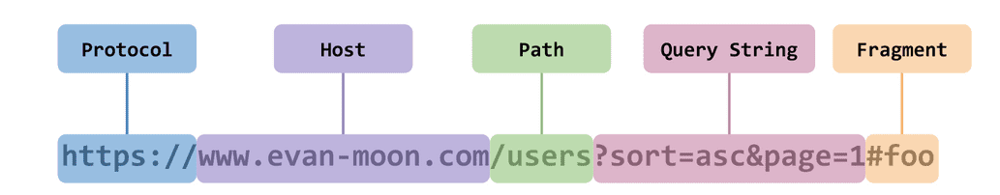

#  CORS 원인 및 해결방법

<span style="color:red;">🚨 Access to fetch at ‘https://api.\*\*\*\*/\*\*\*’ from origin ‘[http://localhost:3000’](http://localhost:3000'/) has been blocked by CORS policy: No ‘Access-Control-Allow-Origin’ header is present on the requested resource. If an opaque response serves your needs, set the request’s mode to ‘no-cors’ to fetch the resource with CORS disabled.</span>

개발을 할 때, 위와 같은 에러가 뜨면서 API 통신이 안되는 상황이 발생했습니다. 어떤 에러이며 이를 해결하려면 어떻게 해야 할까요...?


<br>


## CORS 란?

>  Cross-Origin Resource Sharing 의 약자로 
>
> 하나의 출처에서 실행 중인 웹 애플리케이션이 도메인 또는 포트가 다른 서버의 자원에 접근할 수 있는 권한을 부여하도록 브라우저에 알려주는 체제

- Origin = Protocal + Host



즉 위의 CORS 오류란 서로 다른 Origin(웹 어플리케이션)에서 리소르에 접근할 때 발생하는 오류입니다. 아래 그림처럼 `https://domain-a.com`의 프론트 엔드 JavaScript 코드가 [`XMLHttpRequest`](https://developer.mozilla.org/ko/docs/Web/API/XMLHttpRequest)를 사용하여 `https://domain-b.com/data.json`을 요청하는 경우에 CORS 정책을 사용합니다.


보안의 위험을 보완하기위해 CORS체제는 브라우저와 서버 간의 안전한 교차 출처 요청 및 데이터 전송을 지원합니다.


<br>


## 방식

웹 클라이언트 어플리케이션이 다른 출처의 리소스를 요청할 때는 HTTP 프로토콜을 사용하여 요청을 보내게 되는데, 이때 브라우저는 요청 헤더에 Origin이라는 필드에 요청을 보내는 출처를 함께 담아보냅니다. 이후 서버가 이 요청에 대한 응답을 할 때 응답 헤더의 **Access-Control-Allow-Origin**이라는 값에 “이 리소스를 접근하는 것이 허용된 출처”를 내려주고, 이후 응답을 받은 브라우저는 자신이 보냈던 요청의 Origin과 서버가 보내준 응답의 Access-Control-Allow-Origin을 비교해본 후 이 응답이 유효한 응답인지 아닌지를 결정합니다. 

➡ 💥이 부분에서 위의 에러가 발생한 것 입니다!!


<br>


### 단순요청

`https://foo.example` 의 웹 컨텐츠가  `https://bar.other` 도메인의 컨텐츠를 호출하길 원합니다.


- 브라우저 ➡ server

```
GET /resources/public-data/ HTTP/1.1
Host: bar.other
User-Agent: Mozilla/5.0 (Macintosh; Intel Mac OS X 10.14; rv:71.0) Gecko/20100101 Firefox/71.0
Accept: text/html,application/xhtml+xml,application/xml;q=0.9,*/*;q=0.8
Accept-Language: en-us,en;q=0.5
Accept-Encoding: gzip,deflate
Connection: keep-alive
Origin: https://foo.example
```

host: `https://www.bar.other`에게 Origin: `https://foo.example`가 요청을 보냈어요

- server ➡ 브라우저

```
HTTP/1.1 200 OK
Date: Mon, 01 Dec 2008 00:23:53 GMT
Server: Apache/2
Access-Control-Allow-Origin: *
Keep-Alive: timeout=2, max=100
Connection: Keep-Alive
Transfer-Encoding: chunked
Content-Type: application/xml

[…XML Data…]
```

서버는 이에 대한 응답으로 `Access-Control-Allow-Origin:*` 를 헤더에 담아 응답합니다. ( 모든 도메인에서 접근할 수 있습니다.) `https://bar.other`의 리소스 소유자인 서버가 오직 `https://foo.example`의 요청만 허용하려면 아래를 전송하겠죠.

```
Access-Control-Allow-Origin: https://foo.example
```

### 프리플라이트 요청

`POST`요청을 할 때 preflight request error 발생했는데요. 

먼저 `OPTIONS` 메서드를 통해 서버의에 HTTP 요청을 보내 실제 요청이 전송하기에 안전한 지 확인합니다.(Preflight request) 예비요청의 역할은 본 요청을 보내기 전에 브라우저 스스로 이 요청을 보내는 것이 안전한 지 확인하는 것 입니다. 

> 이말을 듣고 보니, POST 요청엔 필요하겠다 생각하네요. 아무리 다른 토큰을 활용하여 post에 있는 데이터를 보호했더라도 아무곳에나 보내면 안되겠죠. `option`을 통해 미리 보낼곳이 안전한 지 확인 하는거 필요하겠네요.


- 브라우저 ➡ 서버

```
OPTIONS /resources/post-here/ HTTP/1.1
Host: bar.other
User-Agent: Mozilla/5.0 (Macintosh; Intel Mac OS X 10.14; rv:71.0) Gecko/20100101 Firefox/71.0
Accept: text/html,application/xhtml+xml,application/xml;q=0.9,*/*;q=0.8
Accept-Language: en-us,en;q=0.5
Accept-Encoding: gzip,deflate
Connection: keep-alive
Origin: http://foo.example
Access-Control-Request-Method: POST
Access-Control-Request-Headers: X-PINGOTHER, Content-Type
```

`OPTIONS` 메서드로 먼저 서버에 확인요청을 한 것을 알 수 있습니다. 이때,  브라우저에서 `Access-Contro-Request_Method`와 `Access-Control-Request-Headers`를 통해 다음 행동이 무엇이며 어떤 헤더를 사용할 것인 지 알려줍니다.

- 서버 ➡ 브라우저

```
HTTP/1.1 204 No Content
Date: Mon, 01 Dec 2008 01:15:39 GMT
Server: Apache/2
Access-Control-Allow-Origin: https://foo.example
Access-Control-Allow-Methods: POST, GET, OPTIONS
Access-Control-Allow-Headers: X-PINGOTHER, Content-Type
Access-Control-Max-Age: 86400
Vary: Accept-Encoding, Origin
Keep-Alive: timeout=2, max=100
Connection: Keep-Alive
```

 `Access-Control-Allow-Origin:https://foo.example` 를 통해 서버 리소스에 접근이 가능한 출처를 알려주며 실제 `POST`요청 받아들이네요(?)

### Credentialed Request

> 인증된 요청을 사용하는 방법입니다. 
> 이 방식은 CORS의 기본적인 방식이라기 보다는 다른 출처 간 통신에서 좀 더 보안을 강화하고 싶을 때 사용합니다.

이것을 구성하는 옵션에는 총 3가지의 값을 사용할 수 있으며, 각 값들이 가지는 의미는 다음과 같습니다.

1. same-origin (기본값) 같은 출처 간 요청에만 인증 정보를 담을 수 있다
2. include 모든 요청에 인증 정보를 담을 수 있다
3. omit 모든 요청에 인증 정보를 담지 않는다

만약 same-origin이나 include와 같은 옵션을 사용하여 리소스 요청에 인증 정보가 포함된다면, 이제 브라우저는 다른 출처의 리소스를 요청할 때 단순히 Access-Control-Allow-Origin만 확인하는 것이 아니라 좀 더 빡빡한 검사 조건을 추가해야 합니다.

브라우저는 인증 모드가 include일 경우, 모든 요청을 허용한다는 의미의 *를 Access-Control-Allow-Origin 헤더에 사용하면 안된다고 이야기하고 있어요. 이처럼 요청에 인증 정보가 담겨있는 상태에서 다른 출처의 리소스를 요청하게 되면 브라우저는 CORS 정책 위반 여부를 검사하는 룰에 다음 두 가지를 추가하게 됩니다.

**Access-Control-Allow-Origin에는 *를 사용할 수 없으며, **

**명시적인 URL이어야하며 응답 헤더에는 반드시 Allow-Control-Allow Credentials: true가 존재해야 합니다**


<br>


## 해결방법

>  CORS 정책 위반으로 인한 문제가 발생했을 경우에 해결할 수 있는 방법

### 서버에서 세팅하기 (with Django)

CORS 정책 위반으로 인한 문제를 해결하는 가장 대표적인 방법은, 그냥 정석대로 서버에서 `Access-Control-Allow-Origin` 헤더에 알맞은 값을 세팅해주는 것입니다.

이때 와일드카드인 `*`을 사용하여 이 헤더를 세팅하게 되면 모든 출처에서 오는 요청을 받아먹겠다는 의미이므로 당장은 편할 수 있겠지만, 바꿔서 생각하면 정체도 모르는 이상한 출처에서 오는 요청까지 모두 받아먹겠다는 오픈 마인드와 다를 것 없으므로 보안적으로 심각한 이슈가 발생할 수도 있습니다.

1. Django-cors-headers 설치

```bash
pip install django-cors-headers
```

2. settings.py에 설정추가

```bash
INSTALLED_APPS =[ 
	#... 
	'corsheaders'
	]

MIDDLEWARE = [
	'corsheaders.middleware.CorsMiddleware', #최상단에 추가해주기
	#...
]
CORS_ALLOWED_ORIGINS = [
	# 허용할 Origin 추가
    "https://example.com",
    "https://sub.example.com",
    "http://localhost:8080",
    "http://127.0.0.1:9000"
]
# 상황에 따라 모든 도메인에 대해서도 추가가 가능합니다
# CORS_ORIGIN_ALLOW_ALL = True
```

### 클라이언트 쪽에서 해결 (아직 제대로 이해 못함)

내 로컬 개발환경에서 프록시 기능을 사용하여 CORS정책을 우회할 수 있따! 


## 출처

[공식문서](https://developer.mozilla.org/ko/docs/Web/HTTP/CORS)

[진짜 도움 많이 된 곳](https://evan-moon.github.io/2020/05/21/about-cors/)

[벨로그에서](https://velog.io/@geunwoobaek/CORS-%EC%9B%90%EC%9D%B8-%EB%B0%8F-%ED%95%B4%EA%B2%B0%EB%B0%A9%EB%B2%95)