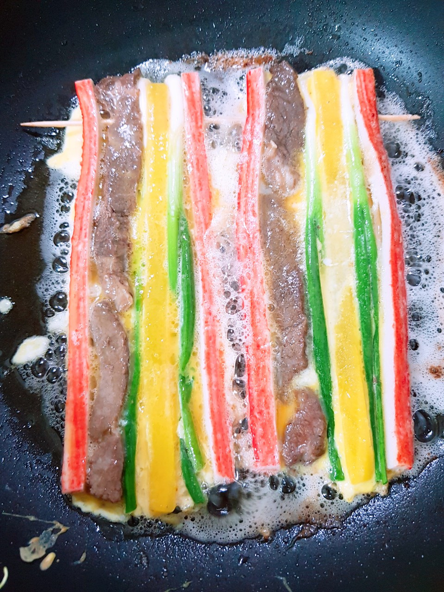

# django_00_Intro

## django??

>python 오픈소스 웹 프레임워크이자 풀 스택 프레임워크입니다. D는 묵음입니다. 쟝고에요 쟝고!
>
>MTB 방식입니다 (대부분은 MVC방식!, 이름만 다를뿐 개념은 같다)


## 설정

시작하기에 앞서 `세팅 전` 구워주겠습니다.



[사진출처](https://www.10000recipe.com/recipe/6905834)

오늘 구워야할 전은 굉장히 많아요!

### django 설치하기

> 파이썬 3.7.7 설치되어 있어야합니다. (3.5버전은 장고2가 설치가 되버립니다.)

```bash
$ pip install django #최신버전설치
$ pip install django==2.1.0  #특정버젼 설치하기
```


### vscode 설정

- django extension 설치하기

- open settings(JSON) 들어가서 복붙

  ```json
  "files.associations": {     "**/*.html": "html",     "**/templates/**/*.html": "django-html",     "**/templates/**/*": "django-txt",     "**/requirements{/**,*}.{txt,in}": "pip-requirements" }, 
   
  "emmet.includeLanguages": {"django-html": "html"}
  ```


지글지글 전굽기 완료....?

사실 구워야 할 전은 더 많이 있어여..


지글지글~~


## django_intro

### 1.프로젝트 만들기

```
django-admin startproject 프로젝트이름 입력
```

```bash
$ django-admin startproject first_project
```

### 2. 서버 실행하기

manage.py가 있는 폴더로 들어가서

```bash
$ python manage.py runserver
```

### 3. 앱 생성하기

```
$ python manage.py startapp 앱이름
```

```bash
$ python manage.py startapp articles
```

-  앱 이름에 `-` 사용할 수 없고, 파이썬이나 장고에서 이미 쓰이는 이름을 쓰면 안됩니다.
- 앱을 생성하면 앱이름을 가진 폴더가 생기고 그 안에 부수적으로 views.py , models.py 등의 파일들이 자동으로 생성됩니다.

### 4. 앱 프로젝트에 등록하기

settings.py 파일에서 Installed_apps 에 내가 방금 만든 app 이름을 상단에 추가한다.

```django
INSTALLED_APPS = [     #내가 만든 apps     
'articles',          
'django.contrib.admin',     
'django.contrib.auth',     
'django.contrib.contenttypes',     
'django.contrib.sessions',     
'django.contrib.messages',     
'django.contrib.staticfiles', ]

```

- settings.py 파일 최하단에 LANGUAGE_CODE = 'ko-kr' 로 바꾸면 한글 설정이 된다
- TIME_ZONE = 'Asia/Seoul' 시간 설정도 바꿀 수 있다

### 0. 참고

startapp으로 앱 생성 후 settings.py 에 앱 등록을 한다. 

반대 순서로 진행하지 않게 주의하자. 

django에는 trailing comma이다. 코드뒤에 아무 것도 없어도 , 를 붙인다. 


## django 시작


**MTV방식** 그 자체!! 두둥

`urls.py` > `views.py` > `templates`

### 1. urls.py : 주소 추가하기

```python
from django.contrib import admin 
from django.urls import path
##
from articles import views 
 
urlpatterns = [     
    path('admin/', admin.site.urls),     
    path('index/', views.index),
]

```

- `articles` 앱에 있는 `views.py` 가져온거 보이시죠?
- `urlpatterns` 안에 `path` 로 주소를 추가한다. 
- `path()` 의 첫 번째 인자로는 유저가 리퀘스트를 보낼 `주소` 를 적는다.
-  `path()` 의 두 번째 인자로는 리턴해 줄 `함수` 이름을 적는다. 
- url 뒤에 / 을 까먹지 말고 붙여주자  //   trailing comma 까먹지 말자

### 2. views.py : 함수만들기

```python
def index(request):  
    context = {
        #dict
    }
    return render(request,'index.html',context)
```

- 위와 같이 사용자가 `특정 url` 에 접속했을 때 불러질 함수를 만든다. 
- 이 때 함수의 첫 번째 인자는 `무조건 request` 이다. 
- render() 를 사용하여 html 페이지를 리턴해주는데, 이 때도 render 의 첫 번째인자는 `무조건 request` 이다. 
- 두 번째 인자로는 `return 할 html 페이지명`을 적는다. 이 때, 장고에서는  앱/templates/ 위치에서 html 파일을 찾기로 정해져있기 때문에, 추가 적으로 경로를 적어줄 필요 없이 `파일명만` 적어주면 된다. 
- `context` 는 return할 html에 `데이터를 보내주는 dictionary`이다
- 마지막으로 앱 안에 `templates` 라는 이름을 가진 폴더를 생성하고, `그 안에서 html 파일을 작업` 해야한다


### 3. templates : 반환 html 만들기

- 앱/templates/ 위치에서 반환해줄 html 페이지 템플릿을 생성한다. 
- 파일명을 render() 함수 두 번째 인자와 같게 설정하면 된다


## Django Template Language (DTL)

>django template system에서 사용하는 built-in template system이다.
>
>조건, 반복, 치환, 필터, 변수 등의 기능을 제공.
>
>프로그래밍적 로직이 아니라 (이건 view에서 한다) 프레젠테이션을 표현하기 위한 것!
>
>파이썬처럼 if,for를 사용할 수 있지만 이것은 단순히 python code로 실행되는 것이 아니다.

### sytax

- variable: `{{  }}`
- filter:  `{{ variable|filter }}`
- tags:  ``