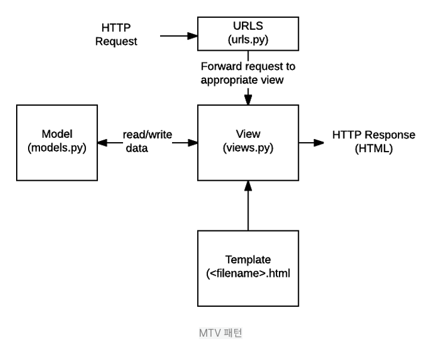
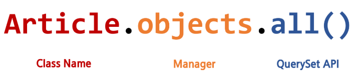

# 코드

>  순서 : 가상환경 생성 -> 필요한 패키지 다운( django 필수)
>
>  -> **프로젝트 , 앱 생성 및 설정** -> **model 생성 (DB)**

## ◾ 프로젝트,앱 생성 및 설정

### 1. 프로젝트 생성

```bash
# django-admin startproject [프로젝트이름]
$ django-admin startproject first_project
```

- project 를 생성할 때, Python 이나 Django 에서 사용중인 이름은 피해야 한다. 
- `-` 도 사용할 수 없다. (ex. django, test, class, django-test...)

### 2. 서버 실행

```bash
$ python manage.py runserver
```

잘 생성되었는 지 확인해보자! 로켓나오면 플젝 잘 만들어진것🚀. 자! 이제 서버 끄자

### 3. 앱 생성

```bash
# python manage.py startapp [앱이름]
$ python manage.py startapp articles
```

- 일반적으로 app 이름은 `복수형`으로 하는 것이 좋다.

### 4. 앱 등록

```python
# settings.py

INSTALLED_APPS = [
    'articles',
    ....
]
```

- 생성한 application을 사용하려면 django프로젝트에 등록해야 하며, 반드시 앱생성 후 등록해야한다.

### 5. Internationalization 설정

```python
# settings.py

LANGUAGE_CODE = 'ko-kr'
TIME_ZONE = 'Asia/Seoul'
```

[참고](https://docs.djangoproject.com/en/3.1/topics/i18n/)

## ◾ Model 정의 및 DB 연동

### 1. Model.py 정의

```python
# articles/models.py
from django.db import models
# 아래 두개는 난중에 (Media - 이미지업로드) 사용할 패키지 입니다.
from imagekit.models import ProcessedImageField
from imagekit.processors import Thumbnail

Class Article(models.Model):
	title = models.CharField(max_lenght=10)
    content = models.TextField()
    created_at = models.DataTimeField(auto_now_add = True)
    updated_at = models.DataTimeField(auto_add = True)
    # 이미지를 담아둘 필드
    image = ProcessedImageField(
        blank=True,
        format="JPEG",
        processors=[Thumbnail(200,300)],
        upload_to="%Y/%m/%d/"
    )
```

### 2. Migration 작업

> django가 모델에 생긴 변화(필드를 추가했다던가 모델을 삭제했다던가 등)를 반영하는 방법

**makemigrations**

```bash
$ python manage.py makemigrations
```

- migraion파일은 DB 스키마를 위한 버전관리 시스템

-> articles/migrations/ 0001_initial.py 생성

**migrate**

```bash
$ python manage.py migrate
```

- 설계도를 실제 DB에 반영하는 과정

--옵션--

**sqlmigrate**

```bash
$ python manage.py sqlmigrate aricles 0001
```

- 해당 migrations 설계도가 SQL 문으로 어떻게 해석되어서 동작할지 미리 확인

**showmigrations**

```bash
$ python manage.py showmigrations
```

- migrations 설계도들이 migrate 됐는지 안됐는지 여부를 확인

### 0. VSCode extension

> sqlite 설치 : vscode 내에서 db구성을 쉽게 보여주는 확장파일


# --------------------------------


# 개념

## ◽ Model.py

### 1. 대표 필드

- `CharField(max_length=None, **options)`
  - 길이의 제한이 있는 문자열을 넣을 때 사용
  - CharField의 max_length는 필수 인자
  - **필드의 최대 길이(문자),** 데이터베이스 레벨과 Django의 유효성 검사(값을 검증하는 것)에서 활용
  - 문자열 필드 → 텍스트 양이 많을 경우 `TextField()` 사용
  - 기본 양식 위젯은 **TextInput**

- `TextField(**options)`

  - **글의 수가 많을 때 사용**
  - max_length 옵션을 주면 자동양식필드의 textarea 위젯에 반영은 되지만 모델과 데이터베이스 수준에는 적용되지 않는다. (CharField 를 사용)
  - 기본 양식 위젯은 **Textarea**

- `DateTimeField(auto_now=False, auto_now_add=False, **options)`

  - 최초 생성 일자

    - `auto_now_add=True`

    - django ORM이 **최초 insert(테이블에 데이터 입력)시**에만 **현재 날짜와 시간으로 갱신(테이블에 어떤 값을 최초로 넣을 때)**

  - 최종 수정 일자

    - `auto_now=True`

    - django ORM이 **save를 할 때마다 현재 날짜와 시간으로 갱신**

## ◽ Migrations

### 1. makemigrations

- 모델을 변경한 것에 기반한 새로운 마이그레이션을 만들 때 사용
- 모델을 활성화 하기 전에 DB 설계도(마이그레이션) 작성
- migrations 폴더 안에 정의한 class를 토대로 Django ORM이 우리에게 만들어준 설계도 확인

### 2. migrate

- 기존에 내가 `[models.py](<http://models.py>)` 에 정의하지 않았던 테이블은 장고가 기존에 미리 만들어 놓은 테이블

- `migrate` 는 `makemigrations` 로 만든 설계도를 실제 `db.sqlite3` DB에 반영한다.

- 모델에서의 변경 사항들과 DB의 스키마가 동기화를 이룬다.

## ◽ Database API

> django가 기본적으로 orm을 제공함에 따른 것으로 db를 편하게 조작할 수 있도록 도와줌
>
> 구문 : [참고1](https://docs.djangoproject.com/en/3.1/ref/models/querysets/#queryset-api-reference) [참고2](https://docs.djangoproject.com/en/3.1/topics/db/queries/#making-queries)



### 1. Objects manager

> Django 모델에 데이터베이스 쿼리 작업이 제공되는 인터페이스 [참고](https://docs.djangoproject.com/en/3.1/topics/db/managers/#managers)

- Model Manager와 Django Model 사이의 ***Query 연산의 인터페이스 역할\*** 을 해주는 친구
- 즉, `models.py` 에 설정한 클래스(테이블)을 불러와서 사용할 때 DB와의 interface 역할을 하는 매니저
- ORM이 클래스로 만든 인스턴스 객체와 db를 연결하는데 그 사이에서 통역 역할을 하는게 ORM의 역할이라고 생각하면 된다. 즉, DB를 Python class로 조작할 수 있는 manager
  - **Python Class(`models.py`) ——— objects ——— DB**
- Django는 기본적으로 모든 Django 모델 클래스에 대해 '`objects`' 라는 Manager(django.db.models.Manager) 객체를 자동으로 추가한다.
- Manager(objects)를 통해 특정 데이터를 조작(메서드)할 수 있다.

### 2. QuerySet API

>데이터베이스로부터 데이터를 읽고, 필터를 걸거나 정렬 등을 수행
>
>쿼리(질문)를 DB에게 던져서 글을 읽거나, 생성하거나, 수정하거나, 삭제

- 데이터베이스에서 전달 받은 객체의 목록
- django orm에서 발생한 자료형
- objects를 사용하여 복수의 데이터를 가져오는 함수를 사용할 때 반환되는 객체
- 단일한 객체를 리턴할 때는 테이블(Class)의 인스턴스로 리턴됨

