# Tree

>  부모 노드 밑에 여러 자식 노드가 연결되고, 자식 노드 각각에 다시 자식 노드가 연결되는 재귀적 형태의 자료구조

## 특징

- 비선형구조
- 원소들 간에 1:n 관계를 가지는 자료구조
- 원소들 간에 계층관계를 가지는 계층형 자료구조
- 상위 원소에서 하위 원소로 내려가면서 확장되는 트리 모양의 구조

## 용어


- __루트 노드__(root node): 부모가 없는 노드, 트리는 하나의 루트 노드만을 가진다.  
  - A
- __단말 노드__(leaf node): 자식이 없는 노드, ‘말단 노드’ 또는 ‘잎 노드’라고도 부른다.
  - H,I,J,F,G
- __간선__(edge): 노드를 연결하는 선 (link, branch 라고도 부름)
  - A-B, A-C, ... C-G
- `형제`(sibling): 같은 부모를 가지는 노드
  - B,C // D,E,F,G // ..
- __조상노드__ : 간선을 따라 루트 노드까지 이르는 경로에 있는 모든 노드
  - H의 조상노드 : D, B, A
- __자손노드__ : 서브 트리에 있는 하위 레벨의 노드들
  - B의 자손노드 : D,E,H,I,J
- 노드의 크기(size): 자신을 포함한 모든 자손 노드의 개수
- 노드의 깊이(depth): 루트에서 어떤 노드에 도달하기 위해 거쳐야 하는 간선의 수
- 노드의 __레벨__(level): 트리의 특정 깊이를 가지는 노드의 집합
- 노드의 차수(degree): 하위 트리 개수 / 간선 수 (degree) = 각 노드가 지닌 가지의 수
- 트리의 차수(degree of tree): 트리의 최대 차수
- 트리의 높이(height): 루트 노드에서 가장 깊숙히 있는 노드의 깊이

# Binary Tree

> 이진트리는 트리를 구성하는 노드들의 최대 차수(degree)가 2인 노드들로 구성되는 트리이다.

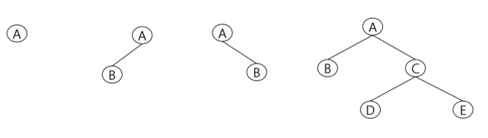

## 특징

- 레벨 i에서의 노드의 최대 개수 2^i개
- 높이가 h인 이진트리가 가질 수 있는 노드의 최소 개수는 (h+1)개가 되며 최대 개수는 2^(h+1)-1 개가 된다.

## 종류

### 포화 이진 트리

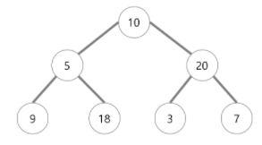

- perfect binary tree
- 모든 트리의 자식은 0개나 2개

- 모든 레벨에서 노드가 포화상태로 차 있는 이진 트리
- 높이가 h일 때, 최대의 노드 개수인 2^(h+1)-1의 노드를 가진 이진트리 eg) 높이 3일 때 15개의 노드
- 루트를 1번으로 하여 2^(h+1)-1까지 정해진 위치에 대한 노드 번호를 가짐

### 정 이진 트리

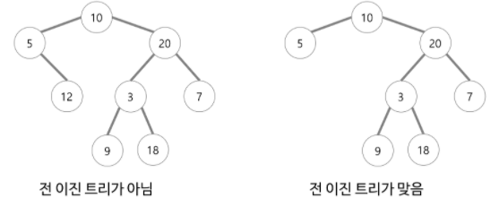

- full binary tree
- 모든 리프 노드의 높이가 같다.

### 완전 이진 트리 

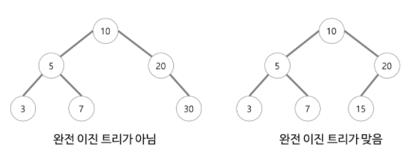

- complete binary tree
- 높이가 h이고 노드 수가 n개일 때, 포화 이진 트리의 노드번호 1번부터 n번까지 빈 자리가 없는 이진 트리

- 마지막 레벨은 꽉 차 있지 않아도 되지만 노드가 왼쪽에서 오른쪽으로 채워져야 한다.
- `힙`

## 순회

> 순회(traversal)란 트리의 각 노드를 중복되지 않게 전부 방문하는 것을 말하는데, 트리는 `비선형구조`이기 때문에 선형구조와 같이 선후연결관계를 알 수 없다.

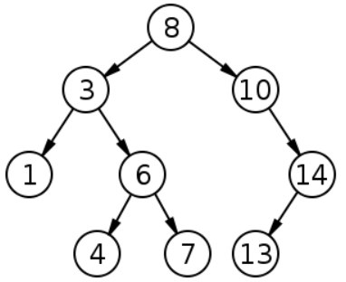

### 전위순회

- preorder :VLR

- 부모노드 방문 후, 자식노드를 좌,우 순서로 방문한다.

- 8,3,10,1,6,4,7,14,13

- ```python
  def preorder(node):
      if node:
          visit(node)
          preorder(node.left)
          preorder(node.right)
  ```

### 중위순회

- inorder : LVR

- 왼쪽 자식노드, 부모노드, 오른쪽 자식노드 순으로 방문한다.

- 1, 3, 4, 6, 7, 13, 14, 10, 8

- ```python
  def inorder(node):
      if node:
          inorder(node.left)
          visit(node)
          inorder(node.right)
  ```

### 후위순회

- postorder : LRV

- 자식노드를 좌우 순서로 방문한 후, 부모노드로 방문한다.

- 1, 4, 7, 6, 3, 13, 14, 10, 8

- ```python
  def postorder(node):
      if node:
          visit(node)
          postorde(node.left)
          postorde(node.right)
  ```

## 이진트리 표현

> 비선형성을 가진 트리구조를 어떻게 표현할까?
>
> - 배열활용
> - 연결리스트

### 배열 활용

> 포화이진트리느낌으로 배열을 일단 선언해준다 

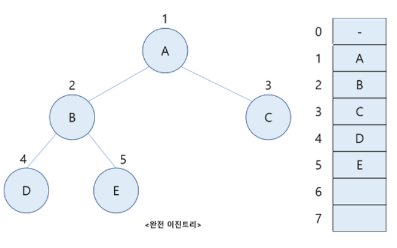

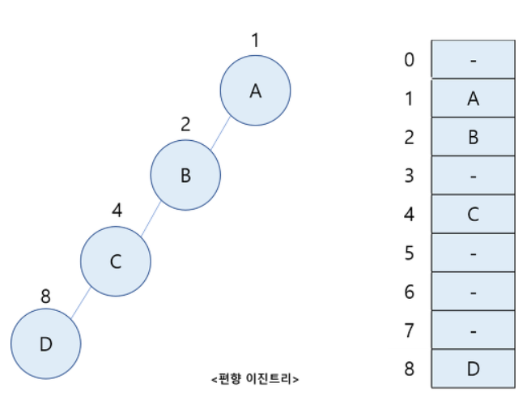

- 높이가 h일 때, 최대의 노드 개수인 2^(h+1)-1의 노드를 가진 이진트리 활용

- 노드 번호의 성질 활용
  - 노드번호가 i 인 노드의 `부모노드번호`=i//2
  - 노드번호가 i 인 노드의 `왼쪽자식노드번호`=2*i
  - 노드번호가 i 인 노드의 `오른쪽자식노드번호`=2*i+1
  - 레벨 n의 노드의 시작 노드번호 = 2^n

- 단점
  - 편향 이진트리처럼 메모리 공간 낭비 발생
  - 트리 중간에 새로운 노드를 삽입하거나 기존의 노드를 삭제할 경우 배열의 크기 변경이 어려워 비효율적

- ```python
  def preorder_traverse(T):
      if T:
          print("%d" % T, end=' ')
          preorder_traverse(tree[T][0])
          preorder_traverse(tree[T][1])
  
  n = int(input())
  tree = [[0] * 2 for _ in range(n + 1)]
  
  templ = list(map(int, input().split()))
  
  for i in range(len(templ) // 2):
      parent, child = templ[i * 2], templ[i * 2 + 1]
      if not tree[parent][0] :
          tree[parent][0] = child
      else:
          tree[parent][1] = child
  
  preorder_traverse(1)
  ```

- 

### 연결리스트 활용

> 배열의 단점을 보완하기 위해 연결리스트를 활용한다. 
>
> 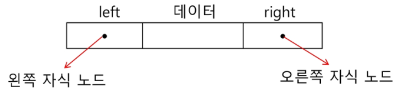

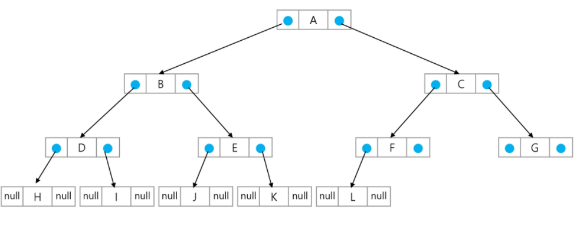

- 이진트리의 모든 노드는 최대 2개의 자식노드를 가지므로 일정한 구조의 단순 연결 리스트 노드를 사용하여 구현

- ```python
  def pr(root):
      print(root, end=' ')
      if len(E[root])>0:
          pr(E[root][0])
      if len(E[root])>1:
          pr(E[root][1])
  
  #    for child in E[root]:
  #        pr(child)
  
  V = int(input())
  S = list(map(int, input().split()))
  
  E = {k:[] for k in range(1, V + 1)}
  
  i = 0
  while i < len(S):
      E[S[i]].append(S[i+1])
      i += 2
  print(E)
  
  i= S[0]
  pr(i)
  ```

# Binary Search Tree

> 모든 노드가 자신의 왼쪽 서브트리에는 현재노드보다 작은 키값이, 오른쪽 서브트리에는 현재 노드보다 큰 값이 오는 규칙을 만족하는 이진트리

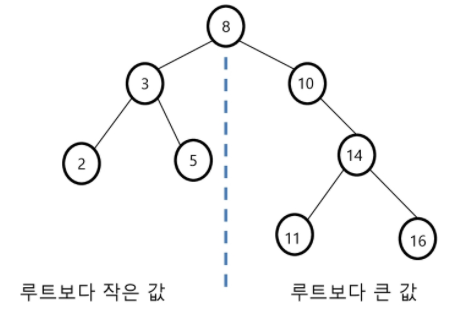

## 특징

- 탐색작업을 효율적으로 하기 위한 자료구조
- 모든 원소는 서로 다른 유일한 키를 가진다
- key(왼쪽서브트리) < key(루트노드) < key(오른쪽서브트리)
- 왼쪽, 오른쪽 서브트리는 이진 탐색 트리다.
- 중위순회하면 오름차순으로 정렬된 값을 가진다

## 탐색연산

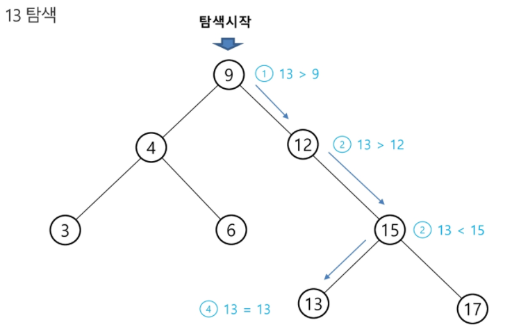

1. 루트에서 시작한다
2. 탐색할 키 값을 루트노드의 키와 비교한다
   1. 키값x == 루트노드의 키값 : 원하는 원소를 찾았다!!
   2. 키값x < 루트노드의 키값 : 루트노드의 `왼쪽` 서브트리에서 탐색연산 수행
   3. 키값x > 루트노드의 키값 : 루트노드의 `오른쪽` 서브트리에서 탐색연산 수행

3. 서브트리에 대해서 2번 탐색연산을 반복한다. 찾을때 까지..

## 삽입

> x 데이터를 삽입하기에 앞서, x를 키값으로 가지는 원소가 있는지 탐색을 한다.
>
> 존재하지 않아서 탐색이 종료되면, 그자리에 삽입한다.

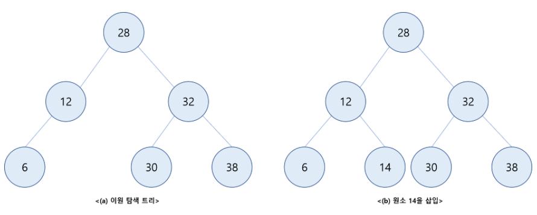

## 삭제

> 주워진 키 값을 가진 원소를 삭제하려 할 때 제일먼저 해야 할 일은 이원 탐색 트리에서 이 키값을 가진 원소를 찿아내는 것이다. 만일 이 삭제할 원소를 성공적으로 찿으려면 수행해야 될 삭제 연산은 이 원소가 가진 자식의 수( 자식이 없는경우, 자식이 하나인경우, 자식이 둘인경우)에 따라 3가지 경우가 있다.

**1. 자식이 없는 리프 노드의 삭제**

삭제해야 될 노드가 자식이 없는 리프 노드의 경우에는 무모 노드의 해당 링크 필드를 null로 만들면 된다.

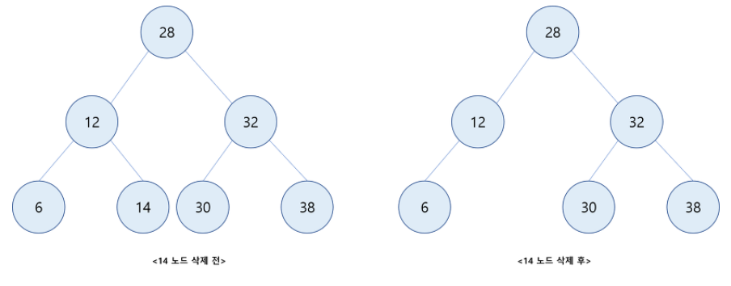

**2. 자식이 하나인 노드의 삭제**

삭제될 노드가 하나의 자식만을 가지고 있는 노드의 경우에는 삭제되는 노드의 자리에 하나밖에 없는 그 자식 노드를 위치시켜면 된다.

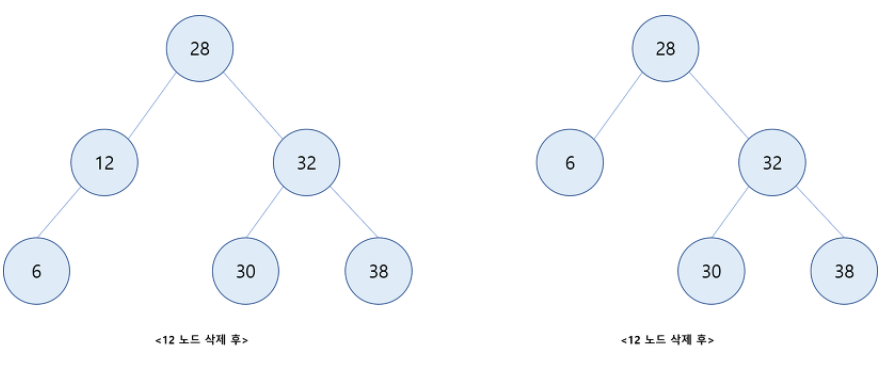

**3. 자식이 둘인 노드의 삭제**

삭제해야 될 노드가 두 자식을 가진 경우에는 먼저 삭제되는 그 노드의 자리에 그의 왼쪽 서브트리에서 가장 큰 원소로 대체할 것인지 또는 그의 오른쪽 서브트리에서 제일 작은 원소로 대체할 것인지 선택하여야 한다. 그런 다음 해당 서브트리에서 이 대체 원소를 삭제하면 된다.

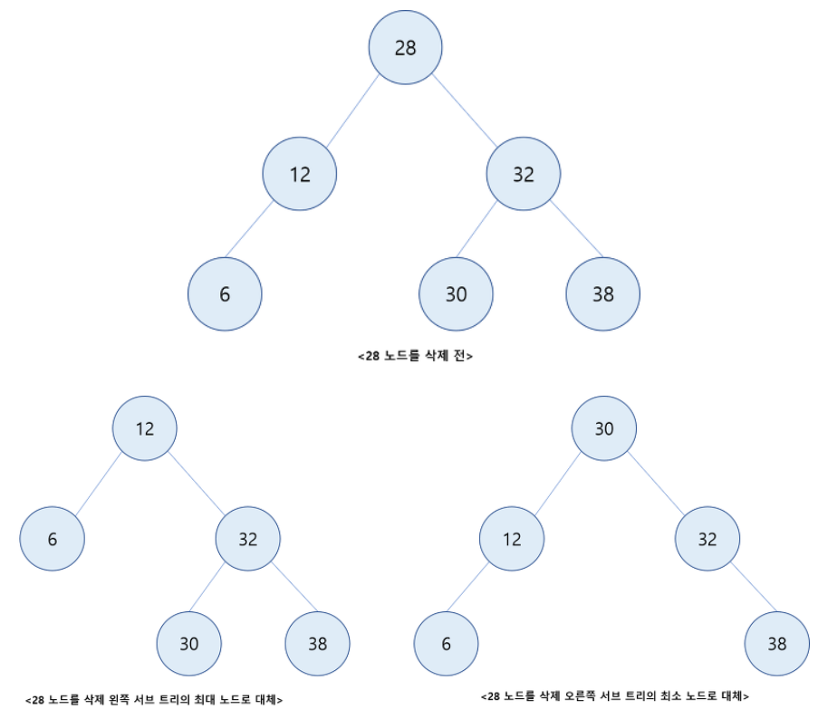

# Heap

> 힙(heap)은 **완전이진트리(Complete binary tree)** 를 기본으로 한 우선순위 큐를 위하여 만들어진 자료구조

## 특징

## 종류

## 삽입

## 삭제


**출처**

https://kingpodo.tistory.com/29?category=805745 